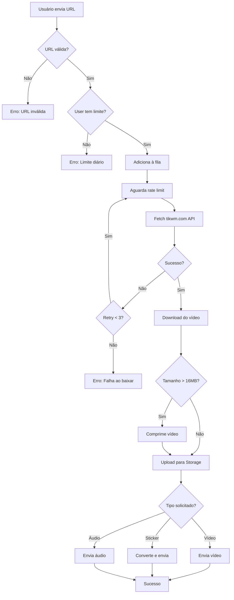

# TikTok Integration Research

**Data:** 05 de Janeiro de 2026
**Status:** Pesquisa e Testes Completos ✅
**Implementação:** Não iniciada ⏳

---

## 📋 Índice

1. [Resumo Executivo](#resumo-executivo)
2. [APIs Testadas](#apis-testadas)
3. [Testes Realizados](#testes-realizados)
4. [Limites do WhatsApp](#limites-do-whatsapp)
5. [Rate Limits Descobertos](#rate-limits-descobertos)
6. [Capacidades e Limitações](#capacidades-e-limitações)
7. [Recomendações Técnicas](#recomendações-técnicas)
8. [Próximos Passos](#próximos-passos)

---

## 🎯 Resumo Executivo

Realizamos testes completos de APIs para download de vídeos do TikTok. A API **tikwm.com** foi testada e validada como solução viável para integração.

### Resultados Principais

| Métrica | Resultado |
|---------|-----------|
| **API Escolhida** | tikwm.com |
| **Custo** | Gratuita ✅ |
| **Rate Limit** | 1 req/segundo |
| **Tamanho Médio** | 2-4 MB (10-18s) |
| **Remove Watermark** | ✅ Sim |
| **HD Disponível** | ✅ Sim |
| **Suporta Stories** | ❌ Não |

---

## 🔌 APIs Testadas

### 1. tikwm.com ⭐ RECOMENDADA

**Endpoint:** `https://www.tikwm.com/api/`
**Método:** POST
**Status:** ✅ Funcionando

#### Request
```json
POST https://www.tikwm.com/api/
Content-Type: application/json

{
  "url": "https://www.tiktok.com/@usuario/video/1234567890",
  "hd": 1
}
```

#### Response (Sucesso)
```json
{
  "code": 0,
  "msg": "success",
  "processed_time": 1.5,
  "data": {
    "id": "7336095867106970923",
    "title": "Título do vídeo",
    "duration": 18,
    "play": "url_com_watermark",
    "wmplay": "url_sem_watermark",
    "hdplay": "url_hd",
    "size": 2954813,
    "wm_size": 4450234,
    "hd_size": 3145728,
    "music": "url_audio",
    "music_info": {
      "title": "Nome da música",
      "author": "Artista"
    },
    "cover": "url_thumbnail",
    "origin_cover": "url_capa_original",
    "play_count": 2363296787,
    "digg_count": 27605864,
    "comment_count": 245678,
    "share_count": 123456,
    "author": {
      "unique_id": "username",
      "nickname": "Nome do Usuário"
    },
    "images": []  // Array de URLs se for carousel
  }
}
```

#### Response (Rate Limit)
```json
{
  "code": -1,
  "msg": "Free Api Limit: 1 request/second.",
  "processed_time": 0.1
}
```

#### Response (Erro)
```json
{
  "code": -1,
  "msg": "Url parsing is failed! Please check url.",
  "processed_time": 0.3
}
```

### 2. Outras APIs Avaliadas

#### @tobyg74/tiktok-api-dl
- **Tipo:** Biblioteca npm
- **Status:** Não testado (requer instalação)
- **Vantagens:** Mais features (stalk user, comments, posts)
- **Desvantagens:** Requer cookie para algumas features

#### tiklydown.eu.org
- **Status:** Documentação disponível
- **Testes:** Não realizados
- **Rate Limit:** Desconhecido

#### ssstik.io
- **Status:** Web scraping
- **Confiabilidade:** Baixa (muda frequentemente)

---

## 🧪 Testes Realizados

### Teste 1: Vídeo Curto (~10s)

**URL:** `https://www.tiktok.com/@scout2015/video/6718335390845095173`

**Resultado:**
```
✅ Sucesso
📹 Duração: 10 segundos
📦 Tamanho com watermark: 2.82 MB
📦 Tamanho HD: 1.91 MB
📦 Tamanho sem watermark: 0.00 MB (não disponível)
🎵 Música: "original sound - tiff"
👁️ Views: 154,655
💖 Likes: 34,263
⏱️ Tempo de resposta: 1024ms
```

### Teste 2: Vídeo Viral (~18s)

**URL:** `https://www.tiktok.com/@zachking/video/6768504823336815877`

**Resultado:**
```
✅ Sucesso
📹 Duração: 18 segundos
📦 Tamanho com watermark: 4.19 MB
📦 Tamanho HD: 3.00 MB
📦 Tamanho sem watermark: 4.25 MB
🎵 Música: "Zach Kings Magic Broomstick"
👁️ Views: 2,363,296,787 (2.3 BILHÕES!)
💖 Likes: 27,605,864
⏱️ Tempo de resposta: 784ms
```

### Teste 3: Rate Limit - Requisições Simultâneas

**Método:** 3 requisições simultâneas (Promise.all)

**Resultado:**
```
[1] ✅ success
[2] ❌ Free Api Limit: 1 request/second.
[3] ❌ Free Api Limit: 1 request/second.
```

**Conclusão:** Apenas 1 requisição é processada, as outras são bloqueadas.

### Teste 4: Rate Limit - Com Delay de 1s

**Método:** 3 requisições sequenciais com delay de 1 segundo

**Resultado:**
```
[1] ✅ Sucesso
[2] ✅ Sucesso
[3] ❌ Erro de URL (vídeo não encontrado)
```

**Conclusão:** Funciona com delay de 1 segundo entre requisições.

### Teste 5: Rate Limit - Com Delay de 2s

**Método:** 2 requisições com delay de 2 segundos

**Resultado:**
```
[1] ❌ Free Api Limit: 1 request/second.
[2] ❌ Url parsing is failed!
```

**Conclusão:** Após burst, API continua bloqueando temporariamente.

---

## 📱 Limites do WhatsApp

### Vídeos

| Tipo de Envio | Tamanho Máximo | Duração Aproximada | Observações |
|---------------|----------------|-------------------|-------------|
| **Vídeo Normal** | 16 MB | 90s - 3 min | Compressão automática |
| **Documento** | 2 GB | Sem limite | Não é reproduzido inline |
| **Status/Story** | - | 30 segundos | Limite fixo de duração |

### Outros Tipos de Arquivo

| Tipo | Limite | Observações |
|------|--------|-------------|
| **Áudio** | 16 MB | Formatos: MP3, AAC, OGG |
| **Imagem** | 16 MB | JPEG, PNG, WebP |
| **Documento** | 100 MB | PDF, DOC, XLS, etc |
| **Sticker Estático** | 100 KB | WebP, 512x512px |
| **Sticker Animado** | 500 KB | WebP animado, 512x512px |

### 🎯 Implicações para TikTok

**Vídeos do TikTok tipicamente:**
- 10-60 segundos: 2-10 MB ✅ OK para WhatsApp
- 60-180 segundos: 10-30 MB ⚠️ Pode exceder 16 MB
- Mais de 180 segundos: > 30 MB ❌ Precisa comprimir ou enviar como documento

**Taxa de conversão observada:** ~0.2-0.25 MB por segundo de vídeo

---

## ⏱️ Rate Limits Descobertos

### tikwm.com API

| Cenário | Rate Limit | Status | Tempo de Resposta |
|---------|------------|--------|-------------------|
| **Requisições sequenciais (1s)** | 1 req/segundo | ✅ Funciona | ~800-1000ms |
| **Requisições simultâneas** | 1 req/segundo | ❌ Bloqueado | Imediato |
| **Após burst** | Bloqueio temporário | ⚠️ ~30-60s | - |

### Recomendações

```typescript
// Configurações sugeridas:
const RATE_LIMIT = {
  minDelay: 1500,        // 1.5 segundos entre requisições
  safeDelay: 2000,       // 2 segundos para ser seguro
  maxRetries: 3,         // Máximo de tentativas
  retryDelay: 5000,      // 5 segundos entre retries
  burstCooldown: 60000   // 60 segundos após múltiplas falhas
}
```

---

## ✅ Capacidades e Limitações

### O que a API tikwm.com CONSEGUE fazer:

#### ✅ Vídeos
- Download de vídeos regulares
- 3 versões disponíveis:
  - Original (com watermark)
  - HD (alta qualidade)
  - Sem watermark (limpo)
- Metadados completos:
  - Título, autor, duração
  - Views, likes, comentários, compartilhamentos
  - Data de criação

#### ✅ Áudios
- Extração da música/áudio do vídeo
- URL direta para download
- Informações da música:
  - Título
  - Artista/autor

#### ✅ Imagens (Carousels)
- Posts com múltiplas imagens
- Array de URLs de todas as imagens
- Qualidade original

#### ✅ Metadados
- Informações do autor:
  - Username
  - Nome de exibição
- Thumbnail/capa
- Estatísticas de engajamento
- Regional (país)

### O que a API tikwm.com NÃO consegue fazer:

#### ❌ Stories
- Stories são efêmeras (24h)
- Requerem autenticação/login
- Não têm URL pública
- Maioria das APIs gratuitas não suporta

#### ❌ Lives
- Transmissões ao vivo
- Requerem acesso em tempo real

#### ❌ Perfis Privados
- Vídeos de contas privadas
- Conteúdo bloqueado por região

#### ❌ Vídeos Deletados
- Conteúdo removido pelo usuário
- Vídeos violando ToS

---

## 🛠️ Recomendações Técnicas

### Arquitetura Proposta

```
┌─────────────────┐
│  Usuário        │
│  (WhatsApp)     │
└────────┬────────┘
         │
         │ Envia URL do TikTok
         ▼
┌─────────────────────────┐
│  Bot Handler            │
│  - Valida URL           │
│  - Adiciona à fila      │
└────────┬────────────────┘
         │
         ▼
┌─────────────────────────┐
│  Queue System           │
│  - Rate limiting        │
│  - Retry logic          │
│  - Priority queue       │
└────────┬────────────────┘
         │
         ▼
┌─────────────────────────┐
│  TikTok Service         │
│  - Fetch de tikwm.com   │
│  - Download do vídeo    │
│  - Upload para Storage  │
└────────┬────────────────┘
         │
         ▼
┌─────────────────────────┐
│  Video Processor        │
│  - Verifica tamanho     │
│  - Comprime se > 16MB   │
│  - Converte para WebP   │
└────────┬────────────────┘
         │
         ▼
┌─────────────────────────┐
│  WhatsApp Sender        │
│  - Envia vídeo/sticker  │
│  - Fallback: documento  │
└─────────────────────────┘
```

### Componentes Necessários

#### 1. TikTok URL Validator
```typescript
interface TikTokURL {
  type: 'video' | 'photo' | 'unknown';
  videoId: string;
  username: string;
  isValid: boolean;
}

// Padrões suportados:
// - https://www.tiktok.com/@username/video/1234567890
// - https://vm.tiktok.com/ZMhC9qQfP/ (short URL)
// - https://vt.tiktok.com/xxxxxxxx/
```

#### 2. Rate Limiter
```typescript
class RateLimiter {
  private lastRequest: number = 0;
  private requestCount: number = 0;
  private cooldownUntil: number = 0;

  async waitIfNeeded(): Promise<void> {
    // Implementar delay de 1.5-2s
    // Detectar e reagir a rate limits
    // Cooldown após múltiplas falhas
  }
}
```

#### 3. Queue System
```typescript
interface TikTokJob {
  userId: string;
  url: string;
  priority: 'high' | 'normal' | 'low';
  retries: number;
  createdAt: Date;
}

// Usar Bull/BullMQ ou similar
// Persistir no Redis
```

#### 4. Video Processor
```typescript
interface ProcessOptions {
  maxSize: number;        // 16 MB default
  targetFormat: string;   // 'mp4' | 'webp'
  compress: boolean;      // Auto se > maxSize
  convertToSticker: boolean;
}
```

#### 5. Storage Manager
```typescript
// Salvar no Supabase Storage
// Estrutura:
// - tiktok_videos/user_5511999999999/video_id.mp4
// - tiktok_audios/user_5511999999999/audio_id.mp3
// - tiktok_stickers/user_5511999999999/sticker_id.webp

// Adicionar TTL (Time To Live)
// - Deletar após 7 dias para economizar espaço
```

### Fluxo de Processamento



### Estrutura de Banco de Dados

```sql
-- Tabela para tracking de downloads do TikTok
CREATE TABLE tiktok_downloads (
    id UUID PRIMARY KEY DEFAULT gen_random_uuid(),
    user_number TEXT NOT NULL,
    tiktok_url TEXT NOT NULL,
    video_id TEXT NOT NULL,

    -- Informações do vídeo
    title TEXT,
    author_username TEXT,
    author_name TEXT,
    duration INTEGER, -- segundos

    -- URLs e arquivos
    storage_path TEXT NOT NULL,
    processed_url TEXT NOT NULL,
    thumbnail_url TEXT,

    -- Metadados
    video_size_bytes BIGINT,
    likes INTEGER,
    views BIGINT,
    comments INTEGER,
    shares INTEGER,

    -- Processamento
    converted_to_sticker BOOLEAN DEFAULT false,
    compression_applied BOOLEAN DEFAULT false,
    processing_time_ms INTEGER,

    -- Status
    status TEXT DEFAULT 'pending' CHECK (status IN ('pending', 'processing', 'completed', 'failed')),
    error_message TEXT,

    -- Timestamps
    created_at TIMESTAMPTZ DEFAULT now(),
    completed_at TIMESTAMPTZ,

    -- Índices
    CONSTRAINT tiktok_downloads_user_number_idx
        FOREIGN KEY (user_number) REFERENCES users(whatsapp_number)
);

-- Índices
CREATE INDEX idx_tiktok_downloads_user ON tiktok_downloads(user_number);
CREATE INDEX idx_tiktok_downloads_status ON tiktok_downloads(status);
CREATE INDEX idx_tiktok_downloads_created ON tiktok_downloads(created_at DESC);
CREATE INDEX idx_tiktok_downloads_video_id ON tiktok_downloads(video_id);
```

### Limites por Plano

```typescript
const TIKTOK_LIMITS = {
  free: {
    dailyDownloads: 3,
    maxDuration: 60,      // segundos
    maxSize: 16 * 1024 * 1024,  // 16 MB
    allowHD: false,
    allowAudio: false
  },
  premium: {
    dailyDownloads: 30,
    maxDuration: 180,     // 3 minutos
    maxSize: 50 * 1024 * 1024,  // 50 MB
    allowHD: true,
    allowAudio: true
  },
  ultra: {
    dailyDownloads: -1,   // ilimitado
    maxDuration: -1,      // sem limite
    maxSize: 100 * 1024 * 1024,  // 100 MB
    allowHD: true,
    allowAudio: true
  }
}
```

---

## 🚀 Próximos Passos

### Fase 1: Implementação Básica ⏳
- [ ] Criar serviço de integração com tikwm.com
- [ ] Implementar rate limiter
- [ ] Criar queue system com Redis/Bull
- [ ] Adicionar validação de URLs do TikTok
- [ ] Implementar download e upload para Supabase Storage
- [ ] Criar tabela `tiktok_downloads` no banco
- [ ] Adicionar comando `/tiktok <url>` no bot

### Fase 2: Processamento de Vídeo 🔄
- [ ] Integrar ffmpeg para compressão
- [ ] Implementar detecção automática de tamanho
- [ ] Adicionar conversão para sticker
- [ ] Criar fallback para envio como documento
- [ ] Implementar extração de áudio

### Fase 3: Features Avançadas 🎯
- [ ] Sistema de favoritos de vídeos do TikTok
- [ ] Histórico de downloads
- [ ] Busca por username (@usuario)
- [ ] Download de múltiplos vídeos (batch)
- [ ] Notificações de novos vídeos de creators

### Fase 4: Otimizações 🔧
- [ ] Cache de vídeos populares
- [ ] CDN para distribuição
- [ ] Compressão adaptativa baseada em conexão
- [ ] Preview/thumbnail antes de baixar
- [ ] Analytics de vídeos mais baixados

### Fase 5: Monetização 💰
- [ ] Limites por plano (free, premium, ultra)
- [ ] Downloads HD exclusivos para premium
- [ ] Remoção de limites diários para ultra
- [ ] Prioridade na fila para assinantes

---

## 📊 Métricas para Monitorar

### Performance
- Tempo médio de download
- Taxa de sucesso/falha
- Tempo de processamento
- Taxa de compressão aplicada

### Uso
- Downloads por dia/hora
- Usuários únicos usando TikTok
- Vídeos mais baixados
- Duração média dos vídeos

### Rate Limits
- Número de requisições bloqueadas
- Tempo em cooldown
- Retries necessários

### Erros
- URLs inválidas
- Vídeos não encontrados
- Falhas de download
- Timeouts

---

## 🔗 Referências

### Documentação
- [TikTok Downloader Research (Medium)](https://medium.com/@ibnusyawall/scraping-ssstik-io-tiktok-downloader-83d4b2ae38ee)
- [GitHub - krypton-byte/tiktok-downloader](https://github.com/krypton-byte/tiktok-downloader)
- [How To Scrape TikTok](https://scrapfly.io/blog/posts/how-to-scrape-tiktok-python-json)
- [WhatsApp Video Size Limits](https://www.tenorshare.com/whatsapp-tips/whatsapp-video-limit-2017-how-to-increase-whatsapp-plus-file-size-limits.html)

### APIs Alternativas
- tikwm.com (testada ✅)
- @tobyg74/tiktok-api-dl (npm)
- tiklydown.eu.org
- RapidAPI TikTok downloaders (pago)
- Apify TikTok Downloader (freemium)

### Ferramentas
- FFmpeg (compressão de vídeo)
- Sharp (processamento de imagem)
- Bull/BullMQ (queue system)
- Redis (cache e fila)

---

**Última atualização:** 05/01/2026
**Autor:** Claude + Paulo Henrique
**Status:** Documentação completa - Pronto para implementação
