# 🗺️ StickerBot - Fluxos Visuais

Diagramas interativos do funcionamento do bot.

## 📊 Legenda de Status

| Indicador | Significado | Descrição |
|-----------|-------------|-----------|
| ✅ **ATIVO** | Flow está em produção | Código executa automaticamente |
| 🚧 **PREPARADO/DESATIVADO** | Infraestrutura existe mas não é executada | Queue/Worker/Função existem mas nenhum código adiciona jobs |
| 🔄 **EM DESENVOLVIMENTO** | Feature sendo implementada | Código parcialmente implementado |
| ❌ **DESATIVADO** | Feature foi removida/desligada | Código comentado ou removido |

---

## 1. Fluxo Principal do Usuário

**Status**: ✅ ATIVO

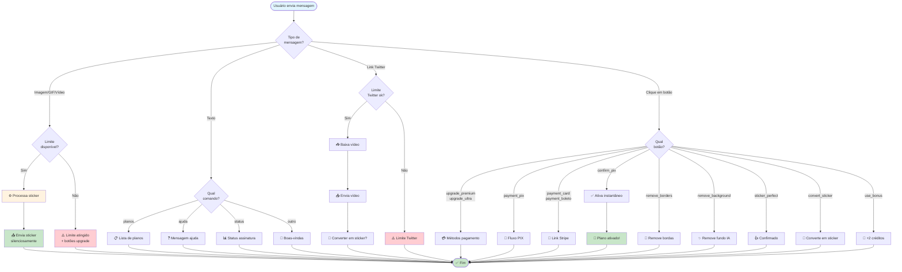
```mermaid
flowchart TD
    START([Usuário envia mensagem]) --> TIPO{Tipo de<br/>mensagem?}

    TIPO -->|Imagem/GIF/Vídeo| CHECK_LIMIT{Limite<br/>disponível?}
    TIPO -->|Texto| CMD{Qual<br/>comando?}
    TIPO -->|Link Twitter| TW_LIMIT{Limite<br/>Twitter ok?}
    TIPO -->|Clique em botão| BTN{Qual<br/>botão?}

    %% Fluxo de Sticker
    CHECK_LIMIT -->|Sim| PROCESS[⚙️ Processa sticker]
    CHECK_LIMIT -->|Não| LIMIT_MSG[⚠️ Limite atingido<br/>+ botões upgrade]
    PROCESS --> SEND_STICKER[📤 Envia sticker<br/>silenciosamente]
    SEND_STICKER --> END_OK([✅ Fim])

    %% 🚧 DESATIVADO: Botões de edição (infraestrutura existe mas não é chamada)
    %% SEND_STICKER -.->|DISABLED| EDIT_BTNS[🎨 Botões de edição]

    %% Fluxo de Comandos
    CMD -->|planos| PLANS_LIST[📋 Lista de planos]
    CMD -->|ajuda| HELP[❓ Mensagem ajuda]
    CMD -->|status| STATUS[📊 Status assinatura]
    CMD -->|outro| WELCOME[👋 Boas-vindas]
    PLANS_LIST --> END_OK
    HELP --> END_OK
    STATUS --> END_OK
    WELCOME --> END_OK

    %% Fluxo Twitter
    TW_LIMIT -->|Sim| TW_DOWNLOAD[📥 Baixa vídeo]
    TW_LIMIT -->|Não| TW_LIMIT_MSG[⚠️ Limite Twitter]
    TW_DOWNLOAD --> TW_SEND[📤 Envia vídeo]
    TW_SEND --> TW_BTNS[🔄 Converter em sticker?]
    TW_BTNS --> END_OK
    TW_LIMIT_MSG --> END_OK

    %% Fluxo de Botões - Upgrade
    BTN -->|upgrade_premium<br/>upgrade_ultra| PAY_METHOD[💳 Métodos pagamento]
    PAY_METHOD --> END_OK

    %% Fluxo de Botões - Pagamento
    BTN -->|payment_pix| PIX_FLOW[🔑 Fluxo PIX]
    BTN -->|payment_card<br/>payment_boleto| STRIPE[🔗 Link Stripe]
    PIX_FLOW --> END_OK
    STRIPE --> END_OK

    %% Fluxo de Botões - Confirmação
    BTN -->|confirm_pix| ACTIVATE[✅ Ativa instantâneo]
    ACTIVATE --> ACTIVATED[🎉 Plano ativado!]
    ACTIVATED --> END_OK

    %% Fluxo de Botões - Edição
    BTN -->|remove_borders| CLEANUP_B[🧹 Remove bordas]
    BTN -->|remove_background| CLEANUP_A[✨ Remove fundo IA]
    BTN -->|sticker_perfect| CONFIRM[👍 Confirmado]
    CLEANUP_B --> END_OK
    CLEANUP_A --> END_OK
    CONFIRM --> END_OK

    %% Fluxo de Botões - Twitter
    BTN -->|convert_sticker| CONVERT[🎨 Converte em sticker]
    CONVERT --> END_OK

    %% Fluxo de Botões - Bônus
    BTN -->|use_bonus| BONUS[🎁 +2 créditos]
    BONUS --> END_OK

    %% Limite
    LIMIT_MSG --> END_OK

    %% Estilos
    style START fill:#e1f5fe
    style END_OK fill:#c8e6c9
    style PROCESS fill:#fff3e0
    style SEND_STICKER fill:#c8e6c9
    style LIMIT_MSG fill:#ffcdd2
    style TW_LIMIT_MSG fill:#ffcdd2
    style ACTIVATED fill:#c8e6c9
```

---

## 2. Fluxo de Assinatura Completo

**Status**: ✅ ATIVO

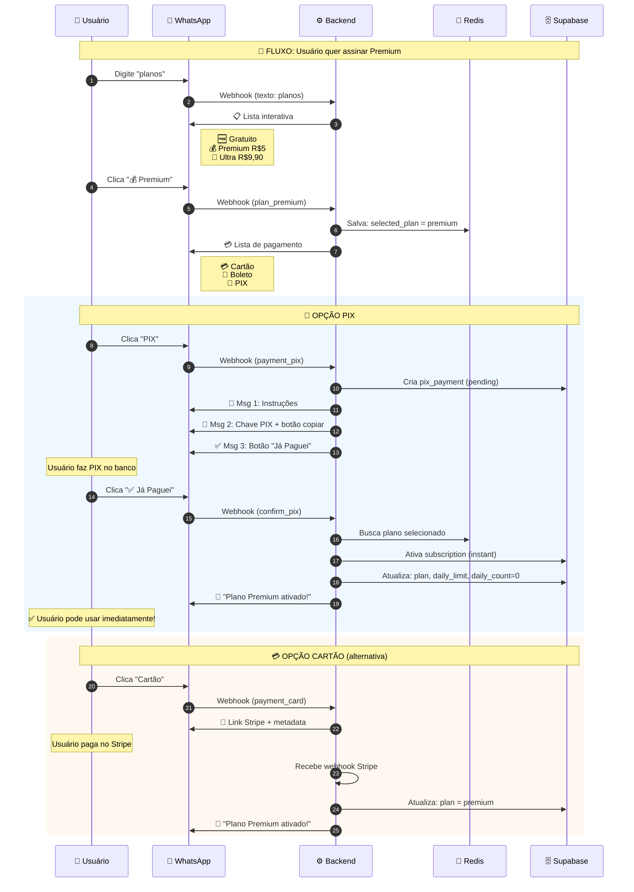
```mermaid
sequenceDiagram
    autonumber
    participant U as 👤 Usuário
    participant W as 📱 WhatsApp
    participant B as ⚙️ Backend
    participant R as 🔴 Redis
    participant DB as 🗄️ Supabase

    Note over U,DB: 🎯 FLUXO: Usuário quer assinar Premium

    U->>W: Digite "planos"
    W->>B: Webhook (texto: planos)
    B->>W: 📋 Lista interativa
    Note right of W: 🆓 Gratuito<br/>💰 Premium R$5<br/>🚀 Ultra R$9,90

    U->>W: Clica "💰 Premium"
    W->>B: Webhook (plan_premium)
    B->>R: Salva: selected_plan = premium
    B->>W: 💳 Lista de pagamento
    Note right of W: 💳 Cartão<br/>🧾 Boleto<br/>🔑 PIX

    rect rgb(240, 248, 255)
        Note over U,DB: 🔑 OPÇÃO PIX
        U->>W: Clica "PIX"
        W->>B: Webhook (payment_pix)
        B->>DB: Cria pix_payment (pending)
        B->>W: 📝 Msg 1: Instruções
        B->>W: 🔑 Msg 2: Chave PIX + botão copiar
        B->>W: ✅ Msg 3: Botão "Já Paguei"

        Note over U: Usuário faz PIX no banco

        U->>W: Clica "✅ Já Paguei"
        W->>B: Webhook (confirm_pix)
        B->>R: Busca plano selecionado
        B->>DB: Ativa subscription (instant)
        B->>DB: Atualiza: plan, daily_limit, daily_count=0
        B->>W: 🎉 "Plano Premium ativado!"
        Note over U: ✅ Usuário pode usar imediatamente!
    end

    rect rgb(255, 248, 240)
        Note over U,DB: 💳 OPÇÃO CARTÃO (alternativa)
        U->>W: Clica "Cartão"
        W->>B: Webhook (payment_card)
        B->>W: 🔗 Link Stripe + metadata

        Note over U: Usuário paga no Stripe

        B->>B: Recebe webhook Stripe
        B->>DB: Atualiza: plan = premium
        B->>W: 🎉 "Plano Premium ativado!"
    end
```

---

## 3. Fluxo de Criação de Sticker

**Status**: ✅ ATIVO

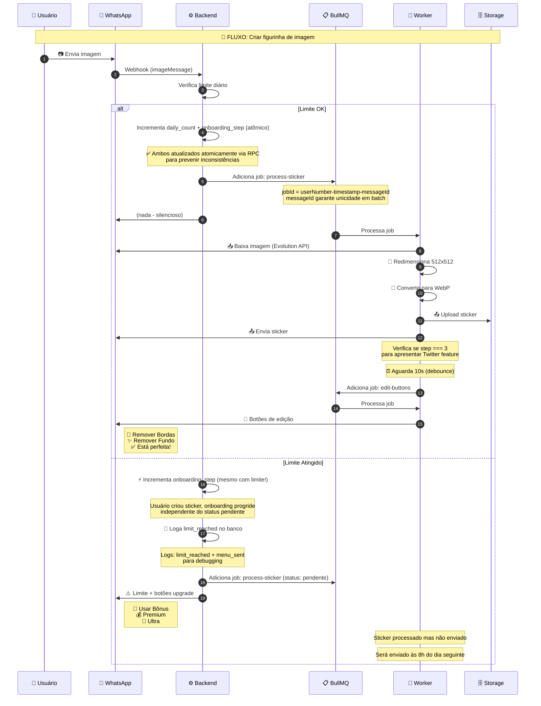
```mermaid
sequenceDiagram
    autonumber
    participant U as 👤 Usuário
    participant W as 📱 WhatsApp
    participant B as ⚙️ Backend
    participant Q as 📋 BullMQ
    participant WK as 👷 Worker
    participant S as 🗄️ Storage

    Note over U,S: 🎨 FLUXO: Criar figurinha de imagem

    U->>W: 📷 Envia imagem
    W->>B: Webhook (imageMessage)

    B->>B: Verifica limite diário

    alt Limite OK
        B->>B: Incrementa daily_count + onboarding_step (atômico)
        Note over B: ✅ Ambos atualizados atomicamente via RPC<br/>para prevenir inconsistências
        B->>Q: Adiciona job: process-sticker
        Note over Q: jobId = userNumber-timestamp-messageId<br/>messageId garante unicidade em batch
        B->>W: (nada - silencioso)

        Q->>WK: Processa job
        WK->>W: 📥 Baixa imagem (Evolution API)
        WK->>WK: 🔄 Redimensiona 512x512
        WK->>WK: 🎨 Converte para WebP
        WK->>S: 📤 Upload sticker
        WK->>W: 📤 Envia sticker

        Note over WK: Verifica se step === 3<br/>para apresentar Twitter feature

        Note over WK: ⏰ Aguarda 10s (debounce)

        WK->>Q: Adiciona job: edit-buttons
        Q->>WK: Processa job
        WK->>W: 🎨 Botões de edição
        Note right of W: 🧹 Remover Bordas<br/>✨ Remover Fundo<br/>✅ Está perfeita!

    else Limite Atingido
        B->>B: ⚡ Incrementa onboarding_step (mesmo com limite!)
        Note over B: Usuário criou sticker, onboarding progride<br/>independente do status pendente
        B->>B: 📝 Loga limit_reached no banco
        Note over B: Logs: limit_reached + menu_sent<br/>para debugging
        B->>Q: Adiciona job: process-sticker (status: pendente)
        B->>W: ⚠️ Limite + botões upgrade
        Note right of W: 🎁 Usar Bônus<br/>💰 Premium<br/>🚀 Ultra

        Note over WK: Sticker processado mas não enviado
        Note over WK: Será enviado às 8h do dia seguinte
    end
```

---

## 4. Fluxo de Download Twitter

**Status**: ✅ ATIVO

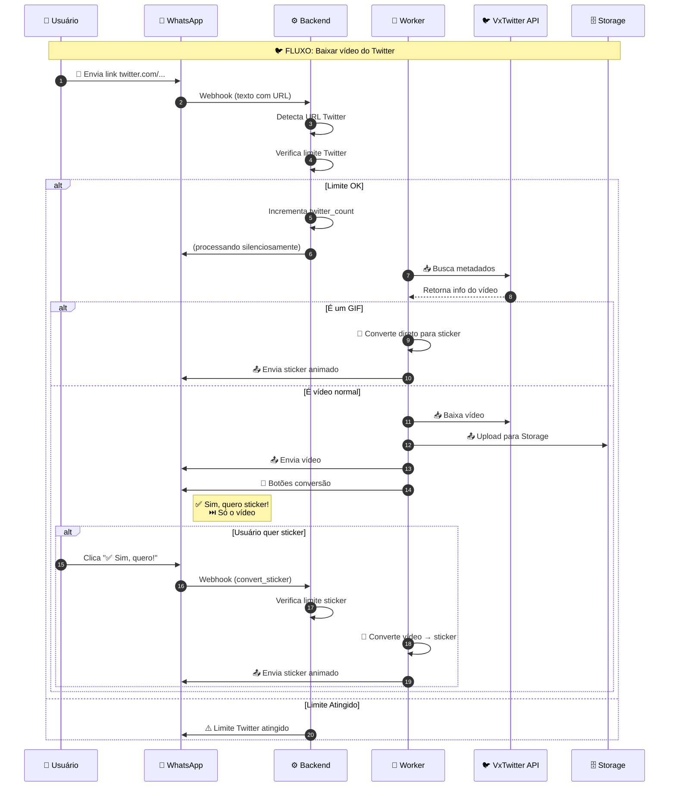
```mermaid
sequenceDiagram
    autonumber
    participant U as 👤 Usuário
    participant W as 📱 WhatsApp
    participant B as ⚙️ Backend
    participant WK as 👷 Worker
    participant TW as 🐦 VxTwitter API
    participant S as 🗄️ Storage

    Note over U,S: 🐦 FLUXO: Baixar vídeo do Twitter

    U->>W: 🔗 Envia link twitter.com/...
    W->>B: Webhook (texto com URL)

    B->>B: Detecta URL Twitter
    B->>B: Verifica limite Twitter

    alt Limite OK
        B->>B: Incrementa twitter_count
        B->>W: (processando silenciosamente)

        WK->>TW: 📥 Busca metadados
        TW-->>WK: Retorna info do vídeo

        alt É um GIF
            WK->>WK: 🎨 Converte direto para sticker
            WK->>W: 📤 Envia sticker animado
        else É vídeo normal
            WK->>TW: 📥 Baixa vídeo
            WK->>S: 📤 Upload para Storage
            WK->>W: 📤 Envia vídeo
            WK->>W: 🔄 Botões conversão
            Note right of W: ✅ Sim, quero sticker!<br/>⏭️ Só o vídeo

            alt Usuário quer sticker
                U->>W: Clica "✅ Sim, quero!"
                W->>B: Webhook (convert_sticker)
                B->>B: Verifica limite sticker
                WK->>WK: 🎨 Converte vídeo → sticker
                WK->>W: 📤 Envia sticker animado
            end
        end

    else Limite Atingido
        B->>W: ⚠️ Limite Twitter atingido
    end
```

---

## 5. Fluxo de Edição de Sticker

**Status: 🚧 PREPARADO/DESATIVADO**

> ⚠️ **IMPORTANTE**: Esta funcionalidade está **DESATIVADA** em produção.
>
> - ✅ **Infraestrutura existe**: Queue `edit-buttons`, Worker, Função `sendStickerEditButtons()`
> - ❌ **Não é executada**: Nenhum código adiciona jobs à fila após enviar sticker
> - 📍 **Localização**: `worker.ts:1490-1558` (worker pronto), `menuService.ts:597-632` (função pronta)
> - 🔧 **Para ativar**: Descomentar linha no worker que adiciona job após enviar sticker
>
> Documentado aqui para referência caso seja reativado no futuro.

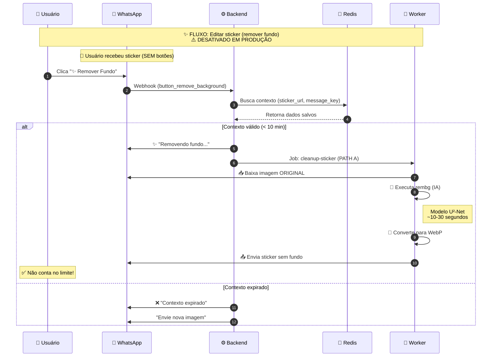
```mermaid
sequenceDiagram
    autonumber
    participant U as 👤 Usuário
    participant W as 📱 WhatsApp
    participant B as ⚙️ Backend
    participant R as 🔴 Redis
    participant WK as 👷 Worker

    Note over U,WK: ✨ FLUXO: Editar sticker (remover fundo)<br/>⚠️ DESATIVADO EM PRODUÇÃO

    Note over W: 🚧 Usuário recebeu sticker (SEM botões)

    U->>W: Clica "✨ Remover Fundo"
    W->>B: Webhook (button_remove_background)

    B->>R: Busca contexto (sticker_url, message_key)
    R-->>B: Retorna dados salvos

    alt Contexto válido (< 10 min)
        B->>W: ✨ "Removendo fundo..."
        B->>WK: Job: cleanup-sticker (PATH A)

        WK->>W: 📥 Baixa imagem ORIGINAL
        WK->>WK: 🤖 Executa rembg (IA)
        Note right of WK: Modelo U²-Net<br/>~10-30 segundos
        WK->>WK: 🎨 Converte para WebP
        WK->>W: 📤 Envia sticker sem fundo

        Note over U: ✅ Não conta no limite!

    else Contexto expirado
        B->>W: ❌ "Contexto expirado"
        B->>W: "Envie nova imagem"
    end
```

---

## 6. Estados do Usuário

**Status**: ✅ ATIVO

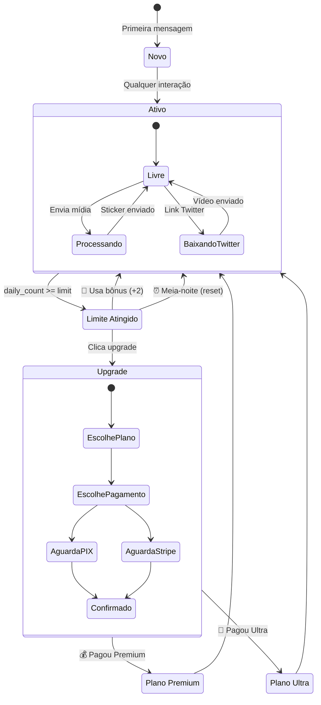
```mermaid
stateDiagram-v2
    [*] --> Novo: Primeira mensagem

    Novo --> Ativo: Qualquer interação

    state Ativo {
        [*] --> Livre

        Livre --> Processando: Envia mídia
        Processando --> Livre: Sticker enviado

        Livre --> BaixandoTwitter: Link Twitter
        BaixandoTwitter --> Livre: Vídeo enviado
    }

    state "Limite Atingido" as Limite
    Ativo --> Limite: daily_count >= limit

    Limite --> Ativo: 🎁 Usa bônus (+2)
    Limite --> Upgrade: Clica upgrade
    Limite --> Ativo: ⏰ Meia-noite (reset)

    state Upgrade {
        [*] --> EscolhePlano
        EscolhePlano --> EscolhePagamento
        EscolhePagamento --> AguardaPIX
        EscolhePagamento --> AguardaStripe
        AguardaPIX --> Confirmado
        AguardaStripe --> Confirmado
    }

    Upgrade --> Premium: 💰 Pagou Premium
    Upgrade --> Ultra: 🚀 Pagou Ultra

    state "Plano Premium" as Premium
    state "Plano Ultra" as Ultra

    Premium --> Ativo
    Ultra --> Ativo
```

---

## 7. Mapa de Mensagens

**Status Geral**: ✅ ATIVO (exceto mensagens marcadas como 🚧)

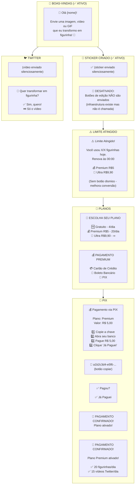
```mermaid
flowchart TB
    subgraph welcome["🎉 BOAS-VINDAS (✅ ATIVO)"]
        W1["🎉 Olá {nome}!<br/><br/>Envie uma imagem, vídeo ou GIF<br/>que eu transformo em figurinha! 🎨"]
    end

    subgraph sticker["🎨 STICKER CRIADO (✅ ATIVO)"]
        S1["✅ (sticker enviado silenciosamente)"]
        S2["🚧 DESATIVADO:<br/>Botões de edição NÃO são enviados<br/>(infraestrutura existe mas não é chamada)"]
    end

    subgraph limit["⚠️ LIMITE ATINGIDO"]
        L1["⚠️ Limite Atingido!<br/><br/>Você usou X/X figurinhas hoje.<br/>Renova às 00:00<br/><br/>💰 Premium R$5<br/>🚀 Ultra R$9,90<br/><br/>(Sem botão dismiss - melhora conversão)"]
    end

    subgraph plans["💎 PLANOS"]
        P1["💎 ESCOLHA SEU PLANO<br/><br/>🆓 Gratuito - 4/dia<br/>💰 Premium R$5 - 20/dia<br/>🚀 Ultra R$9,90 - ∞"]
        P2["💰 PAGAMENTO PREMIUM<br/><br/>💳 Cartão de Crédito<br/>🧾 Boleto Bancário<br/>🔑 PIX"]
    end

    subgraph pix["🔑 PIX"]
        PX1["💰 Pagamento via PIX<br/><br/>Plano: Premium<br/>Valor: R$ 5,00<br/><br/>1️⃣ Copie a chave<br/>2️⃣ Abra seu banco<br/>3️⃣ Pague R$ 5,00<br/>4️⃣ Clique 'Já Paguei'"]
        PX2["🔑 a1b2c3d4-e5f6-...<br/>(botão copiar)"]
        PX3["✅ Pagou?<br/><br/>✅ Já Paguei"]
        PX4["🎉 PAGAMENTO CONFIRMADO!<br/>Plano ativado!"]
        PX5["🎉 PAGAMENTO CONFIRMADO!<br/><br/>Plano Premium ativado!<br/><br/>✅ 20 figurinhas/dia<br/>✅ 15 vídeos Twitter/dia"]
    end

    subgraph twitter["🐦 TWITTER"]
        T1["(vídeo enviado silenciosamente)"]
        T2["🎨 Quer transformar em figurinha?<br/><br/>✅ Sim, quero!<br/>⏭️ Só o vídeo"]
    end

    welcome --> sticker
    sticker --> limit
    limit --> plans
    plans --> pix
    welcome --> twitter
```

---

## 8. Arquitetura de Filas

**Status**: ✅ ATIVO (exceto edit-buttons marcado como 🚧)

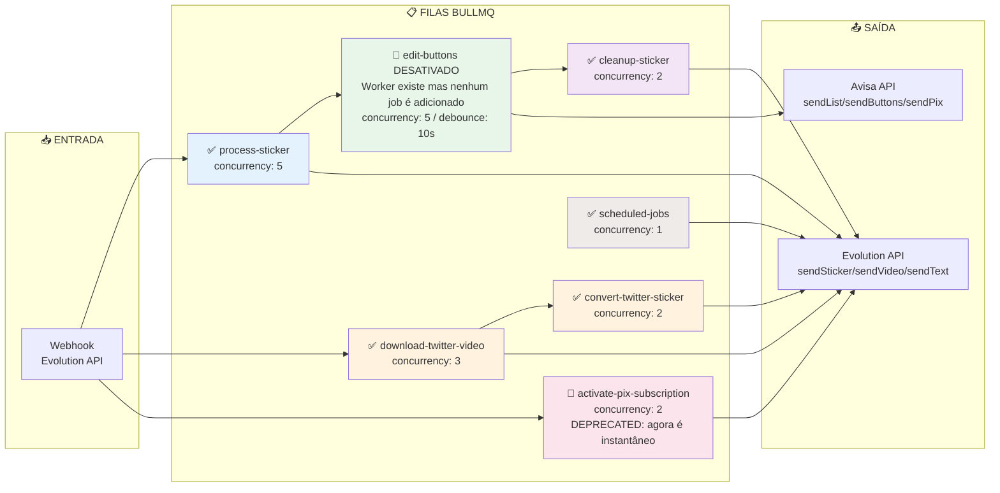
```mermaid
flowchart LR
    subgraph entrada["📥 ENTRADA"]
        WH[Webhook<br/>Evolution API]
    end

    subgraph filas["📋 FILAS BULLMQ"]
        Q1[✅ process-sticker<br/>concurrency: 5]
        Q2[✅ download-twitter-video<br/>concurrency: 3]
        Q3[✅ convert-twitter-sticker<br/>concurrency: 2]
        Q4[✅ cleanup-sticker<br/>concurrency: 2]
        Q5[🚧 edit-buttons DESATIVADO<br/>Worker existe mas nenhum job é adicionado<br/>concurrency: 5 / debounce: 10s]
        Q6[🚧 activate-pix-subscription<br/>concurrency: 2<br/>DEPRECATED: agora é instantâneo]
        Q7[✅ scheduled-jobs<br/>concurrency: 1]
    end

    subgraph saida["📤 SAÍDA"]
        EV[Evolution API<br/>sendSticker/sendVideo/sendText]
        AV[Avisa API<br/>sendList/sendButtons/sendPix]
    end

    WH --> Q1
    WH --> Q2
    WH --> Q6

    Q1 --> Q5
    Q2 --> Q3
    Q5 --> Q4

    Q1 --> EV
    Q2 --> EV
    Q3 --> EV
    Q4 --> EV
    Q5 --> AV
    Q6 --> EV
    Q7 --> EV

    style Q1 fill:#e3f2fd
    style Q2 fill:#fff3e0
    style Q3 fill:#fff3e0
    style Q4 fill:#f3e5f5
    style Q5 fill:#e8f5e9
    style Q6 fill:#fce4ec
    style Q7 fill:#efebe9
```

---

## 9. Fluxo A/B Test - Bonus Credits

**Status**: ❌ DESATIVADO (11/01/2026)

> ⚠️ **EXPERIMENTO DESATIVADO**: Este A/B test foi completamente desativado.
> - Novos usuários sempre vão para grupo `control` (userService.ts)
> - Botão "Usar Bônus" removido do menu de limite atingido (menuService.ts)
> - Usuários antigos do grupo `bonus` não verão mais o botão
> - Dados históricos preservados para análise
> - Substituído pelo experimento `daily_limit_v1` (ver seção 23)

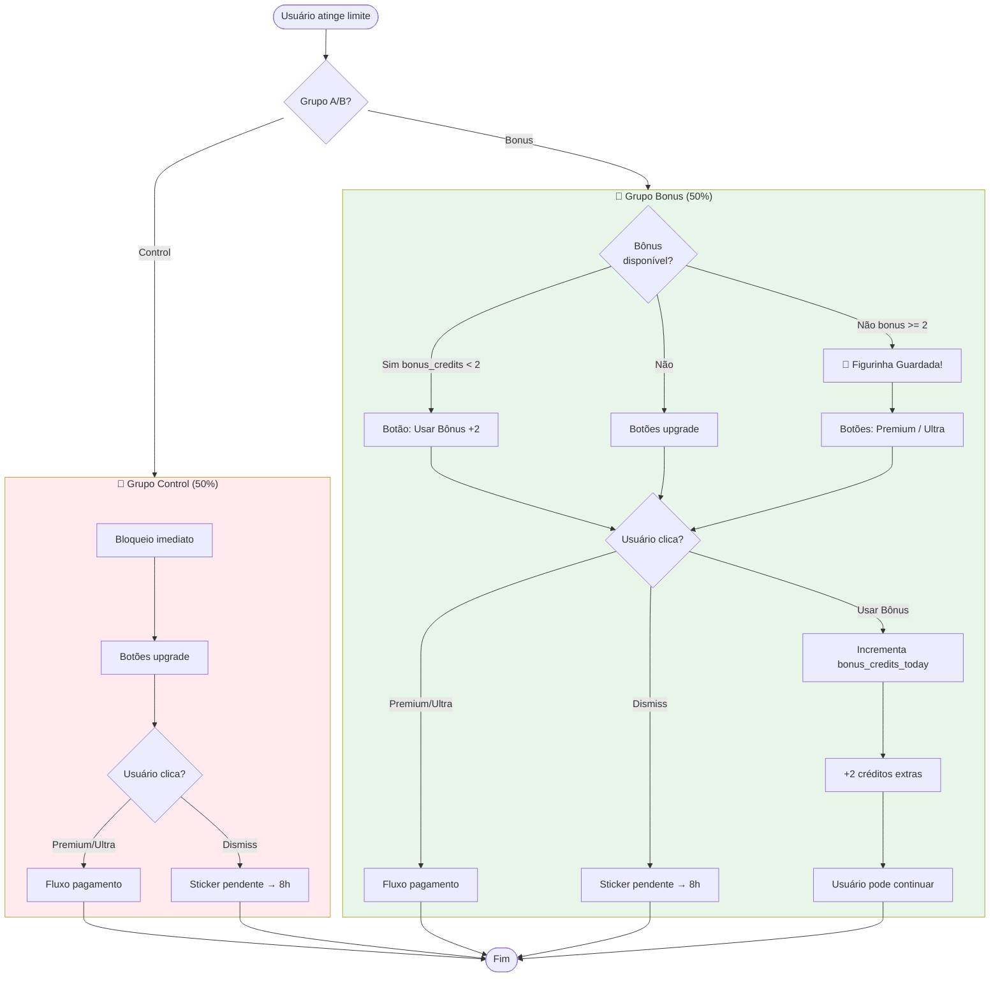
```mermaid
flowchart TD
    START([Usuário atinge limite]) --> CHECK_GROUP{Grupo A/B?}

    CHECK_GROUP -->|Control| CONTROL_FLOW
    CHECK_GROUP -->|Bonus| BONUS_FLOW

    subgraph CONTROL_FLOW["🔴 Grupo Control (50%)"]
        C1[Bloqueio imediato]
        C2[Botões upgrade]
        C3{Usuário clica?}

        C1 --> C2
        C2 --> C3
        C3 -->|Premium/Ultra| C4[Fluxo pagamento]
        C3 -->|Dismiss| C5[Sticker pendente → 8h]
    end

    subgraph BONUS_FLOW["🎁 Grupo Bonus (50%)"]
        B1{Bônus<br/>disponível?}
        B2[Botão: Usar Bônus +2]
        B3[Botões upgrade]
        B4{Usuário clica?}

        B1 -->|Sim bonus_credits < 2| B2
        B1 -->|Não| B3
        B2 --> B4
        B3 --> B4

        B4 -->|Usar Bônus| B5[Incrementa bonus_credits_today]
        B4 -->|Premium/Ultra| B6[Fluxo pagamento]
        B4 -->|Dismiss| B7[Sticker pendente → 8h]

        B5 --> B8[+2 créditos extras]
        B8 --> B9[Usuário pode continuar]

        B1 -->|Não bonus >= 2| B10[📌 Figurinha Guardada!]
        B10 --> B11[Botões: Premium / Ultra]
        B11 --> B4
    end

    C4 --> END([Fim])
    C5 --> END
    B6 --> END
    B7 --> END
    B9 --> END

    style CONTROL_FLOW fill:#ffebee
    style BONUS_FLOW fill:#e8f5e9
```

**Métricas Rastreadas:**
- `ab_test_bonus_offered` - Bonus group vê botão
- `ab_test_bonus_used` - Clique em "Usar Bônus"
- `ab_test_upgrade_click` - Clique em upgrade
- `ab_test_upgrade_dismissed` - Dispensa upgrade
- `ab_test_conversion_paid` - Completou pagamento

**Reset Diário (Meia-noite):**
```sql
UPDATE users SET
  daily_count = 0,
  bonus_credits_today = 0
```

---

## 10. Fluxo Onboarding - Apresentação de Features

**Status**: ✅ ATIVO

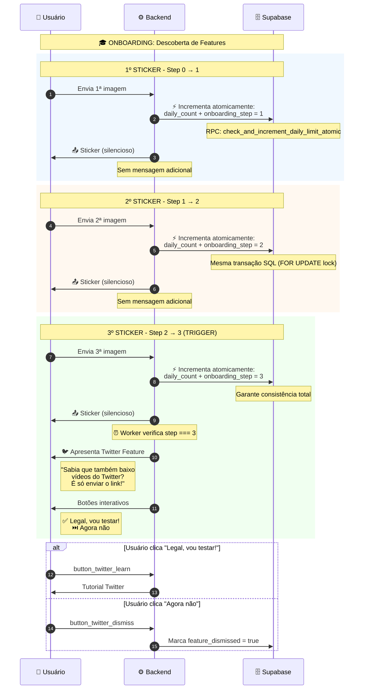
```mermaid
sequenceDiagram
    autonumber
    participant U as 👤 Usuário
    participant B as ⚙️ Backend
    participant DB as 🗄️ Supabase

    Note over U,DB: 🎓 ONBOARDING: Descoberta de Features

    rect rgb(240, 248, 255)
        Note over U,DB: 1º STICKER - Step 0 → 1
        U->>B: Envia 1ª imagem
        B->>DB: ⚡ Incrementa atomicamente:<br/>daily_count + onboarding_step = 1
        Note over DB: RPC: check_and_increment_daily_limit_atomic
        B->>U: 📤 Sticker (silencioso)
        Note over B: Sem mensagem adicional
    end

    rect rgb(255, 248, 240)
        Note over U,DB: 2º STICKER - Step 1 → 2
        U->>B: Envia 2ª imagem
        B->>DB: ⚡ Incrementa atomicamente:<br/>daily_count + onboarding_step = 2
        Note over DB: Mesma transação SQL (FOR UPDATE lock)
        B->>U: 📤 Sticker (silencioso)
        Note over B: Sem mensagem adicional
    end

    rect rgb(240, 255, 240)
        Note over U,DB: 3º STICKER - Step 2 → 3 (TRIGGER)
        U->>B: Envia 3ª imagem
        B->>DB: ⚡ Incrementa atomicamente:<br/>daily_count + onboarding_step = 3
        Note over DB: Garante consistência total
        B->>U: 📤 Sticker (silencioso)

        Note over B: ⏰ Worker verifica step === 3

        B->>U: 🐦 Apresenta Twitter Feature
        Note right of U: "Sabia que também baixo<br/>vídeos do Twitter?<br/>É só enviar o link!"

        B->>U: Botões interativos
        Note right of U: ✅ Legal, vou testar!<br/>⏭️ Agora não
    end

    alt Usuário clica "Legal, vou testar!"
        U->>B: button_twitter_learn
        B->>U: Tutorial Twitter
    else Usuário clica "Agora não"
        U->>B: button_twitter_dismiss
        B->>DB: Marca feature_dismissed = true
    end
```

**Botões:**
- `button_twitter_learn` - Mostrar tutorial
- `button_twitter_dismiss` - Dispensar feature

**Lógica:**
```typescript
// WEBHOOK: Incrementa atomicamente daily_count + onboarding_step
const limitCheck = await checkAndIncrementDailyLimitAtomic(userId);
// limitCheck.onboarding_step contém o novo valor (já incrementado)

// WORKER: Lê step e daily_limit para trigger dinâmico
const { data: userData } = await supabase
  .from('users')
  .select('onboarding_step, daily_limit')
  .eq('whatsapp_number', userNumber)
  .single();

const currentStep = userData?.onboarding_step || 0;
const userDailyLimit = userData?.daily_limit || 4;

// step = 1 (welcome) + stickers_criadas
// Trigger quando user cria min(daily_limit, 3) stickers
// Para limit_2: após 2ª figurinha → step === 3 (1 + 2)
// Para limit_3: após 3ª figurinha → step === 4 (1 + 3)
// Para limit_4: após 3ª figurinha → step === 4 (1 + 3, cap em 3)
const stickersToTrigger = Math.min(userDailyLimit, 3);
const triggerStep = stickersToTrigger + 1; // +1 pelo welcome
const shouldShowTwitter = currentStep === triggerStep;

if (shouldShowTwitter) {
  // stickersToTrigger é o número real de figurinhas criadas neste ponto
  await checkTwitterFeaturePresentation(userNumber, userName, currentStep, stickersToTrigger);
}
```

---

## 11. Fluxo Pending Stickers - Envio às 8h

**Status**: ✅ ATIVO

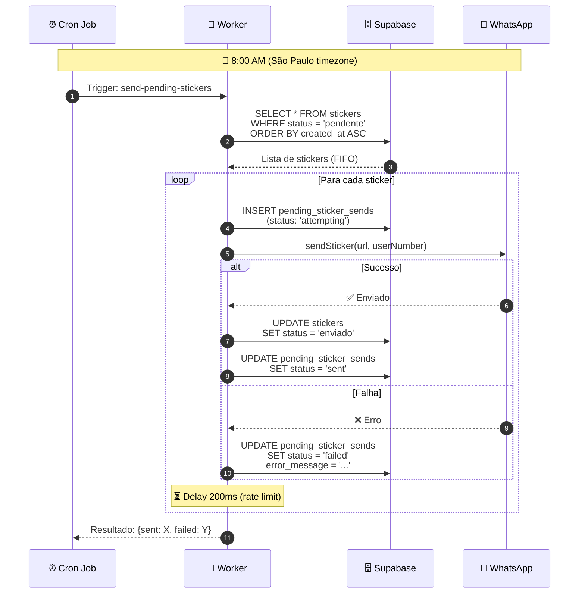
```mermaid
sequenceDiagram
    autonumber
    participant CRON as ⏰ Cron Job
    participant WK as 👷 Worker
    participant DB as 🗄️ Supabase
    participant W as 📱 WhatsApp

    Note over CRON,W: 🌅 8:00 AM (São Paulo timezone)

    CRON->>WK: Trigger: send-pending-stickers

    WK->>DB: SELECT * FROM stickers<br/>WHERE status = 'pendente'<br/>ORDER BY created_at ASC
    DB-->>WK: Lista de stickers (FIFO)

    loop Para cada sticker
        WK->>DB: INSERT pending_sticker_sends<br/>(status: 'attempting')

        WK->>W: sendSticker(url, userNumber)

        alt Sucesso
            W-->>WK: ✅ Enviado
            WK->>DB: UPDATE stickers<br/>SET status = 'enviado'
            WK->>DB: UPDATE pending_sticker_sends<br/>SET status = 'sent'
        else Falha
            W-->>WK: ❌ Erro
            WK->>DB: UPDATE pending_sticker_sends<br/>SET status = 'failed'<br/>error_message = '...'
        end

        Note over WK: ⏳ Delay 200ms (rate limit)
    end

    WK-->>CRON: Resultado: {sent: X, failed: Y}
```

**Tabela: pending_sticker_sends**
```sql
CREATE TABLE pending_sticker_sends (
  id UUID PRIMARY KEY,
  sticker_id UUID REFERENCES stickers(id),
  user_number TEXT,
  attempt_number INT,
  status TEXT, -- 'attempting' | 'sent' | 'failed'
  worker_id TEXT,
  sent_at TIMESTAMP,
  processing_time_ms INT,
  error_message TEXT,
  error_code TEXT,
  created_at TIMESTAMP DEFAULT NOW()
);
```

**Cron Config:**
```typescript
cron.schedule('0 8 * * *', sendPendingStickersJob, {
  timezone: 'America/Sao_Paulo'
});
```

---

## 12. Fluxo Group Messages - Rejeição (Phase 1)

**Status**: ✅ ATIVO

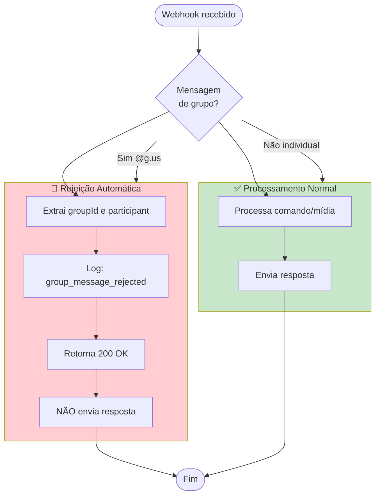
```mermaid
flowchart TD
    START([Webhook recebido]) --> CHECK_GROUP{Mensagem<br/>de grupo?}

    CHECK_GROUP -->|Sim @g.us| REJECT
    CHECK_GROUP -->|Não individual| PROCESS

    subgraph REJECT["🚫 Rejeição Automática"]
        R1[Extrai groupId e participant]
        R2[Log: group_message_rejected]
        R3[Retorna 200 OK]
        R4[NÃO envia resposta]
    end

    subgraph PROCESS["✅ Processamento Normal"]
        P1[Processa comando/mídia]
        P2[Envia resposta]
    end

    CHECK_GROUP --> R1
    R1 --> R2
    R2 --> R3
    R3 --> R4
    R4 --> END([Fim])

    CHECK_GROUP --> P1
    P1 --> P2
    P2 --> END

    style REJECT fill:#ffcdd2
    style PROCESS fill:#c8e6c9
```

**Código (webhook.ts:104-119):**
```typescript
// Phase 1: Ignora grupos completamente
if (remoteJid.endsWith('@g.us')) {
  logger.info({
    msg: 'Group message ignored (Phase 1)',
    groupId: remoteJid,
    participant: pushName
  });
  return reply.code(200).send({ success: true });
}
```

**TODO Phase 2:**
- Suportar grupos com tracking individual
- Comandos apenas para admin
- Rate limiting por grupo

---

## 13. Fluxo Multi-Video Twitter Selection

**Status**: ✅ ATIVO

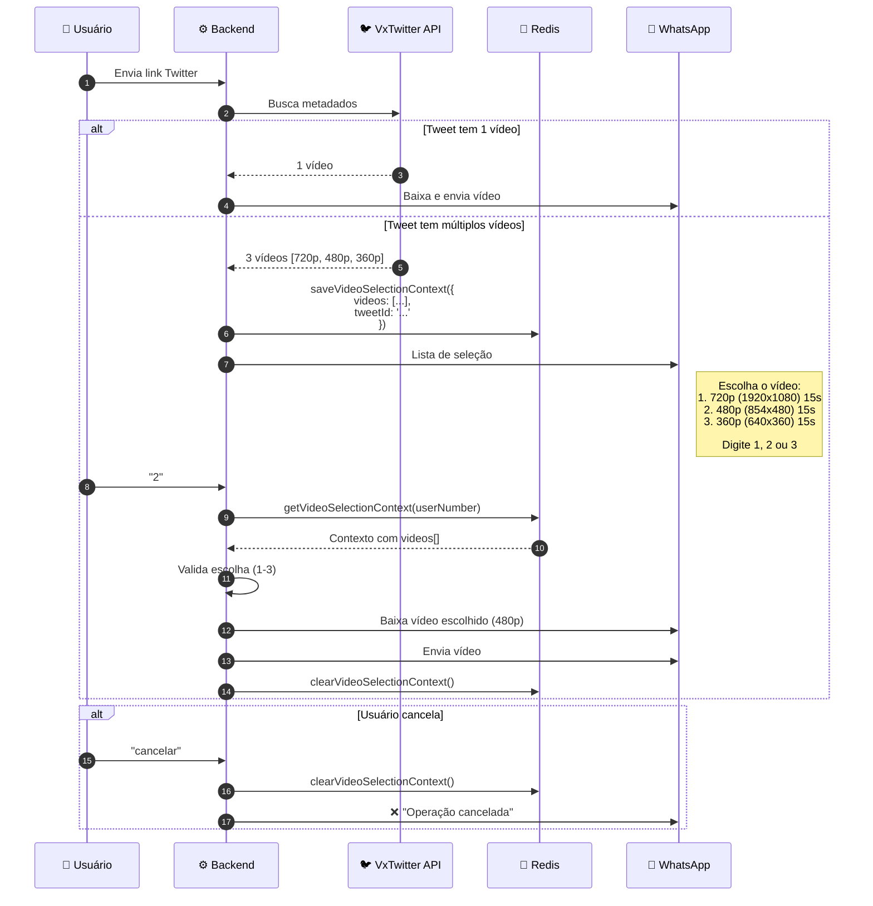
```mermaid
sequenceDiagram
    autonumber
    participant U as 👤 Usuário
    participant B as ⚙️ Backend
    participant TW as 🐦 VxTwitter API
    participant R as 🔴 Redis
    participant W as 📱 WhatsApp

    U->>B: Envia link Twitter
    B->>TW: Busca metadados

    alt Tweet tem 1 vídeo
        TW-->>B: 1 vídeo
        B->>W: Baixa e envia vídeo
    else Tweet tem múltiplos vídeos
        TW-->>B: 3 vídeos [720p, 480p, 360p]

        B->>R: saveVideoSelectionContext({<br/>  videos: [...],<br/>  tweetId: '...'<br/>})

        B->>W: Lista de seleção
        Note right of W: Escolha o vídeo:<br/>1. 720p (1920x1080) 15s<br/>2. 480p (854x480) 15s<br/>3. 360p (640x360) 15s<br/><br/>Digite 1, 2 ou 3

        U->>B: "2"

        B->>R: getVideoSelectionContext(userNumber)
        R-->>B: Contexto com videos[]

        B->>B: Valida escolha (1-3)
        B->>W: Baixa vídeo escolhido (480p)
        B->>W: Envia vídeo
        B->>R: clearVideoSelectionContext()
    end

    alt Usuário cancela
        U->>B: "cancelar"
        B->>R: clearVideoSelectionContext()
        B->>W: ❌ "Operação cancelada"
    end
```

**Context Redis:**
```typescript
interface VideoSelectionContext {
  user_number: string;
  tweet_id: string;
  videos: Array<{
    url: string;
    resolution: string;
    duration: number;
    size_bytes: number;
  }>;
  created_at: string;
  expires_at: string; // 10 minutos
}
```

**Arquivo:** `src/utils/videoSelectionContext.ts`

---

## 14. Fluxo International Number Fallback

**Status**: ✅ ATIVO

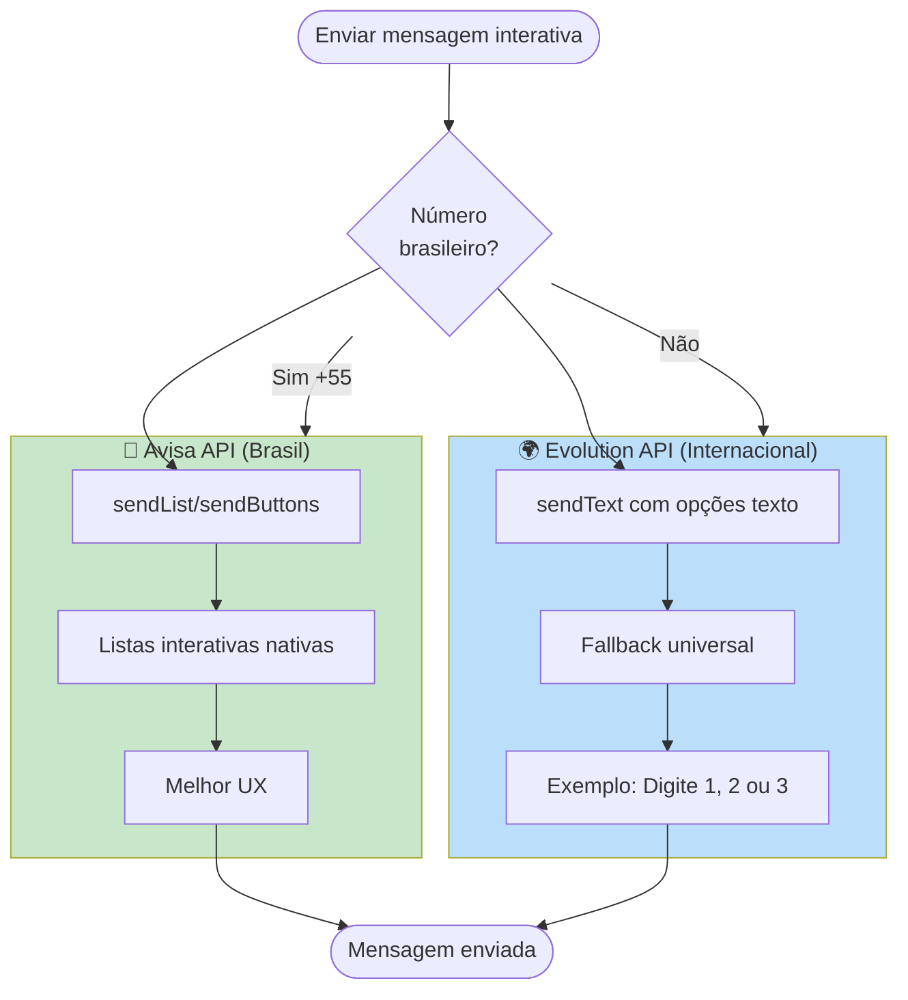
```mermaid
flowchart TD
    START([Enviar mensagem interativa]) --> CHECK_COUNTRY{Número<br/>brasileiro?}

    CHECK_COUNTRY -->|Sim +55| AVISA
    CHECK_COUNTRY -->|Não| EVOLUTION

    subgraph AVISA["📱 Avisa API (Brasil)"]
        A1[sendList/sendButtons]
        A2[Listas interativas nativas]
        A3[Melhor UX]
    end

    subgraph EVOLUTION["🌍 Evolution API (Internacional)"]
        E1[sendText com opções texto]
        E2[Fallback universal]
        E3[Exemplo: Digite 1, 2 ou 3]
    end

    CHECK_COUNTRY --> A1
    A1 --> A2
    A2 --> A3
    A3 --> END([Mensagem enviada])

    CHECK_COUNTRY --> E1
    E1 --> E2
    E2 --> E3
    E3 --> END

    style AVISA fill:#c8e6c9
    style EVOLUTION fill:#bbdefb
```

**Lógica:**
```typescript
function isBrazilianNumber(phone: string): boolean {
  return phone.startsWith('55');
}

async function sendInteractiveMessage(userNumber: string, options) {
  if (isBrazilianNumber(userNumber)) {
    // Use Avisa API (listas/botões nativos)
    await sendList({ number: userNumber, ...options });
  } else {
    // Use Evolution API (texto simples)
    const textOptions = formatAsText(options);
    await sendText(userNumber, textOptions);
  }
}
```

**Exemplo de Fallback:**
```
// Avisa API (Brasil):
┌─────────────────────┐
│ Escolha seu plano:  │
│ ├─ 🆓 Gratuito      │
│ ├─ 💰 Premium       │
│ └─ 🚀 Ultra         │
└─────────────────────┘

// Evolution API (Internacional):
💎 ESCOLHA SEU PLANO

Digite o número:
1. 🆓 Gratuito (4 figurinhas/dia)
2. 💰 Premium (20 figurinhas/dia) - R$ 5/mês
3. 🚀 Ultra (ILIMITADO) - R$ 9,90/mês
```

---

## 15. Comandos de Texto Universais

**Status**: ✅ ATIVO

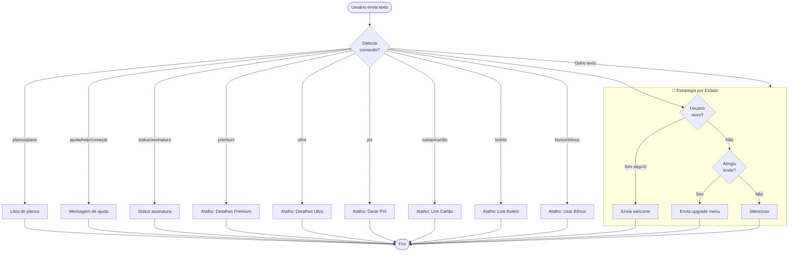
```mermaid
flowchart TD
    START([Usuário envia texto]) --> DETECT{Detecta<br/>comando?}

    DETECT -->|planos/plans| PLANS[Lista de planos]
    DETECT -->|ajuda/help/começar| HELP[Mensagem de ajuda]
    DETECT -->|status/assinatura| STATUS[Status assinatura]

    DETECT -->|premium| SHORTCUT_P[Atalho: Detalhes Premium]
    DETECT -->|ultra| SHORTCUT_U[Atalho: Detalhes Ultra]

    DETECT -->|pix| SHORTCUT_PIX[Atalho: Gerar PIX]
    DETECT -->|cartao/cartão| SHORTCUT_CARD[Atalho: Link Cartão]
    DETECT -->|boleto| SHORTCUT_BOLETO[Atalho: Link Boleto]

    DETECT -->|bonus/bônus| SHORTCUT_BONUS[Atalho: Usar Bônus]

    DETECT -->|Outro texto| STRATEGY{Estratégia}

    subgraph STRATEGY["🎯 Estratégia por Estado"]
        ST1{Usuário<br/>novo?}
        ST2{Atingiu<br/>limite?}
        ST3[Silencioso]

        ST1 -->|Sim step=0| ST4[Envia welcome]
        ST1 -->|Não| ST2
        ST2 -->|Sim| ST5[Envia upgrade menu]
        ST2 -->|Não| ST3
    end

    PLANS --> END([Fim])
    HELP --> END
    STATUS --> END
    SHORTCUT_P --> END
    SHORTCUT_U --> END
    SHORTCUT_PIX --> END
    SHORTCUT_CARD --> END
    SHORTCUT_BOLETO --> END
    SHORTCUT_BONUS --> END

    DETECT --> ST1
    ST4 --> END
    ST5 --> END
    ST3 --> END
```

**Comandos Implementados:**

| Comando | Aliases | Ação |
|---------|---------|------|
| Planos | `planos`, `plans` | Lista interativa |
| Ajuda | `ajuda`, `help`, `começar` | Mensagem ajuda |
| Status | `status`, `assinatura` | Ver assinatura |
| Premium | `premium` | Detalhes Premium |
| Ultra | `ultra` | Detalhes Ultra |
| PIX | `pix` | Gerar PIX direto |
| Cartão | `cartao`, `cartão` | Link cartão |
| Boleto | `boleto` | Link boleto |
| Bônus | `bonus`, `bônus` | Usar bônus (se disponível) |

---

## 16. Botões de Retry e Suporte

**Status**: ✅ ATIVO

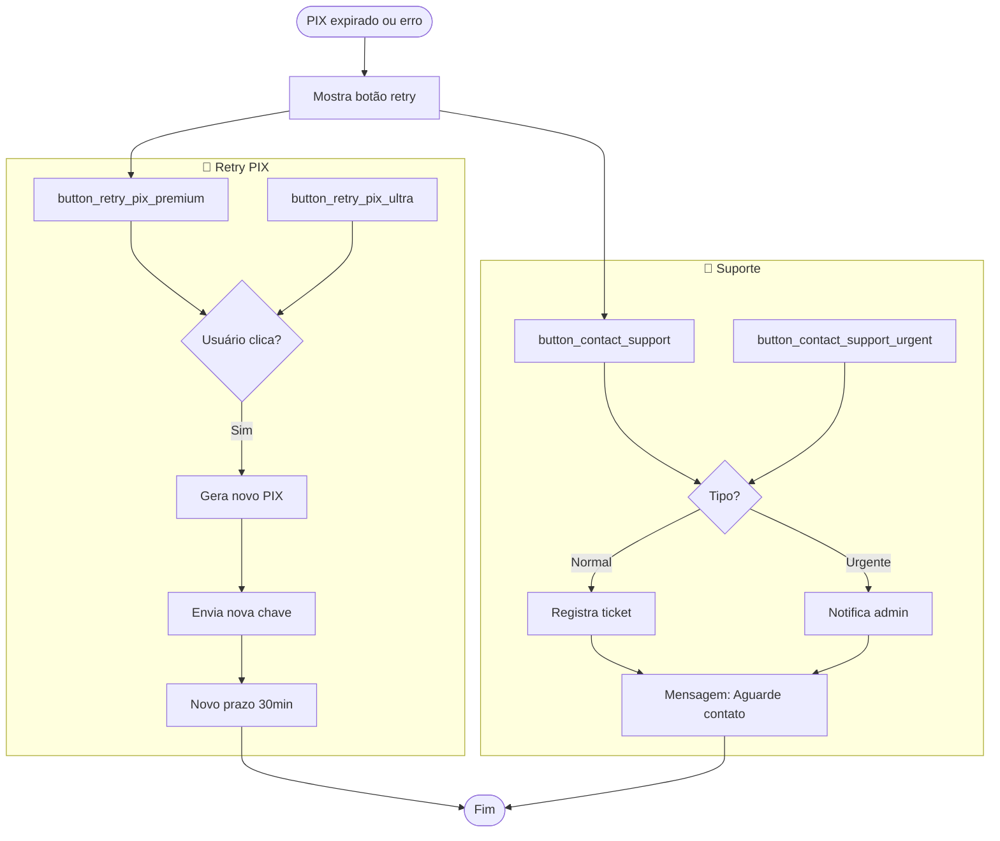
```mermaid
flowchart TD
    START([PIX expirado ou erro]) --> SHOW_RETRY[Mostra botão retry]

    subgraph RETRY_FLOW["🔄 Retry PIX"]
        R1[button_retry_pix_premium]
        R2[button_retry_pix_ultra]
        R3{Usuário clica?}

        R3 -->|Sim| R4[Gera novo PIX]
        R4 --> R5[Envia nova chave]
        R5 --> R6[Novo prazo 30min]
    end

    subgraph SUPPORT_FLOW["💬 Suporte"]
        S1[button_contact_support]
        S2[button_contact_support_urgent]
        S3{Tipo?}

        S3 -->|Normal| S4[Registra ticket]
        S3 -->|Urgente| S5[Notifica admin]

        S4 --> S6[Mensagem: Aguarde contato]
        S5 --> S6
    end

    SHOW_RETRY --> R1
    SHOW_RETRY --> S1

    R1 --> R3
    R2 --> R3

    S1 --> S3
    S2 --> S3

    R6 --> END([Fim])
    S6 --> END
```

**Botões Implementados:**

| Button ID | Contexto | Ação |
|-----------|----------|------|
| `retry_pix_premium` | PIX Premium expirado | Gera novo PIX Premium |
| `retry_pix_ultra` | PIX Ultra expirado | Gera novo PIX Ultra |
| `contact_support` | Qualquer erro | Abre ticket suporte |
| `contact_support_urgent` | Erro crítico | Notifica admin |

---

## 17. Cleanup Sticker - Dois Paths

**Status**: ✅ ATIVO

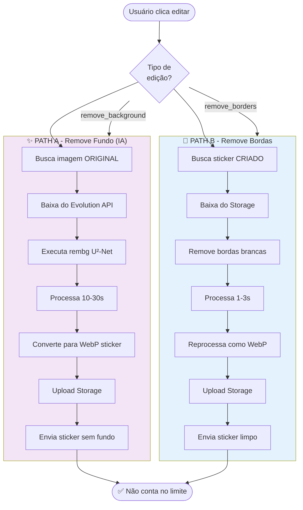
```mermaid
flowchart TD
    START([Usuário clica editar]) --> CHECK_TYPE{Tipo de<br/>edição?}

    CHECK_TYPE -->|remove_background| PATH_A
    CHECK_TYPE -->|remove_borders| PATH_B

    subgraph PATH_A["✨ PATH A - Remove Fundo (IA)"]
        A1[Busca imagem ORIGINAL]
        A2[Baixa do Evolution API]
        A3[Executa rembg U²-Net]
        A4[Processa 10-30s]
        A5[Converte para WebP sticker]
        A6[Upload Storage]
        A7[Envia sticker sem fundo]
    end

    subgraph PATH_B["🧹 PATH B - Remove Bordas"]
        B1[Busca sticker CRIADO]
        B2[Baixa do Storage]
        B3[Remove bordas brancas]
        B4[Processa 1-3s]
        B5[Reprocessa como WebP]
        B6[Upload Storage]
        B7[Envia sticker limpo]
    end

    CHECK_TYPE --> A1
    A1 --> A2 --> A3 --> A4 --> A5 --> A6 --> A7

    CHECK_TYPE --> B1
    B1 --> B2 --> B3 --> B4 --> B5 --> B6 --> B7

    A7 --> END([✅ Não conta no limite])
    B7 --> END

    style PATH_A fill:#f3e5f5
    style PATH_B fill:#e3f2fd
```

**Diferenças:**

| Aspecto | PATH A (Background) | PATH B (Borders) |
|---------|---------------------|------------------|
| Input | Imagem original | Sticker criado |
| Ferramenta | rembg (IA) | Sharp (crop) |
| Tempo | 10-30s | 1-3s |
| Qualidade | Alta (IA) | Boa (corte) |
| messageType | Presente | Ausente |

**Worker Code:**
```typescript
if (jobData.messageType) {
  // PATH A: Remove background da imagem original
  const originalImage = await downloadFromEvolution(jobData.messageKey);
  const result = await execRembg(originalImage);
} else {
  // PATH B: Remove bordas do sticker
  const sticker = await downloadFromStorage(jobData.stickerPath);
  const result = await removeBorders(sticker);
}
```

---

## 18. Admin Panel - Dashboard Structure

**Status**: ✅ ATIVO

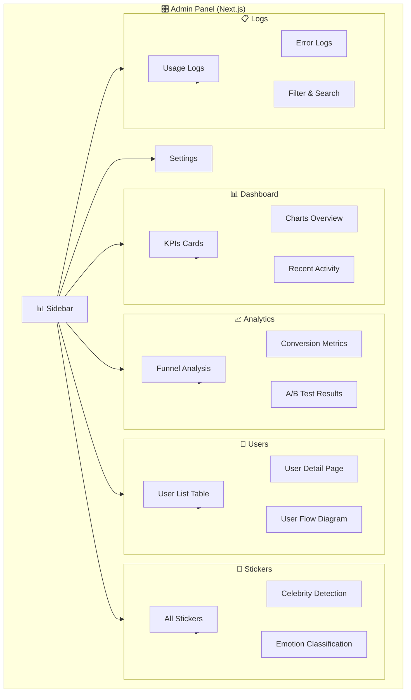
```mermaid
graph TB
    subgraph ADMIN["🎛️ Admin Panel (Next.js)"]
        SIDEBAR[📊 Sidebar]

        SIDEBAR --> DASHBOARD[Dashboard]
        SIDEBAR --> ANALYTICS[Analytics]
        SIDEBAR --> USERS[Users]
        SIDEBAR --> STICKERS[Stickers]
        SIDEBAR --> LOGS[Logs]
        SIDEBAR --> SETTINGS[Settings]
    end

    subgraph DASHBOARD["📊 Dashboard"]
        D1[KPIs Cards]
        D2[Charts Overview]
        D3[Recent Activity]
    end

    subgraph ANALYTICS["📈 Analytics"]
        AN1[Funnel Analysis]
        AN2[Conversion Metrics]
        AN3[A/B Test Results]
    end

    subgraph USERS["👥 Users"]
        U1[User List Table]
        U2[User Detail Page]
        U3[User Flow Diagram]
    end

    subgraph STICKERS["🎨 Stickers"]
        S1[All Stickers]
        S2[Celebrity Detection]
        S3[Emotion Classification]
    end

    subgraph LOGS["📋 Logs"]
        L1[Usage Logs]
        L2[Error Logs]
        L3[Filter & Search]
    end

    DASHBOARD --> D1
    DASHBOARD --> D2
    DASHBOARD --> D3

    ANALYTICS --> AN1
    ANALYTICS --> AN2
    ANALYTICS --> AN3

    USERS --> U1
    USERS --> U2
    USERS --> U3

    STICKERS --> S1
    STICKERS --> S2
    STICKERS --> S3

    LOGS --> L1
    LOGS --> L2
    LOGS --> L3
```

**Páginas:**
- `/admin-panel` - Dashboard
- `/admin-panel/analytics` - Métricas gerais
- `/admin-panel/analytics/funnel` - Análise de funil
- `/admin-panel/users` - Lista de usuários
- `/admin-panel/users/[id]` - Detalhes do usuário
- `/admin-panel/users/flow` - Diagrama de fluxo
- `/admin-panel/stickers` - Todos stickers
- `/admin-panel/stickers/celebrities` - Detecção celebridades
- `/admin-panel/stickers/emotions` - Classificação emoções
- `/admin-panel/logs` - Logs de uso
- `/admin-panel/logs/errors` - Logs de erros
- `/admin-panel/settings` - Configurações

**Stack:**
- Next.js 14 (App Router)
- Recharts (visualização)
- Supabase Client (queries)
- TailwindCSS (styling)

---

## 19. Scheduled Jobs Detalhado

**Status**: ✅ ATIVO

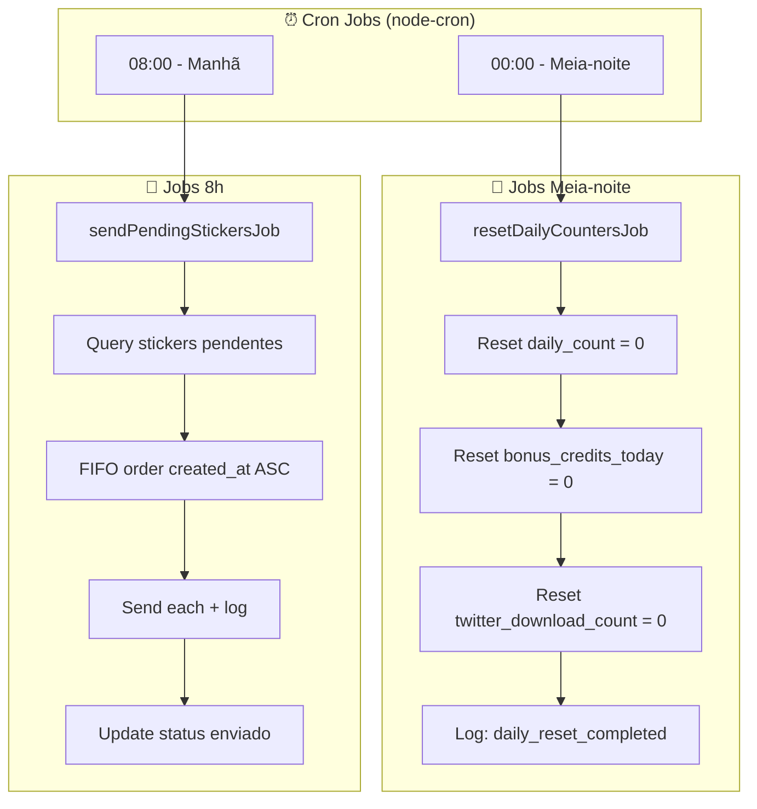
```mermaid
flowchart TB
    subgraph CRON["⏰ Cron Jobs (node-cron)"]
        MIDNIGHT[00:00 - Meia-noite]
        MORNING[08:00 - Manhã]
    end

    subgraph MIDNIGHT_JOBS["🌙 Jobs Meia-noite"]
        M1[resetDailyCountersJob]
        M2[Reset daily_count = 0]
        M3[Reset bonus_credits_today = 0]
        M4[Reset twitter_download_count = 0]
        M5[Log: daily_reset_completed]
    end

    subgraph MORNING_JOBS["🌅 Jobs 8h"]
        MR1[sendPendingStickersJob]
        MR2[Query stickers pendentes]
        MR3[FIFO order created_at ASC]
        MR4[Send each + log]
        MR5[Update status enviado]
    end

    MIDNIGHT --> M1
    M1 --> M2
    M2 --> M3
    M3 --> M4
    M4 --> M5

    MORNING --> MR1
    MR1 --> MR2
    MR2 --> MR3
    MR3 --> MR4
    MR4 --> MR5
```

**Configuração (src/jobs/index.ts):**
```typescript
// Meia-noite (SP timezone)
cron.schedule('0 0 * * *', resetDailyCountersJob, {
  timezone: 'America/Sao_Paulo'
});

// 8h da manhã (SP timezone)
cron.schedule('0 8 * * *', sendPendingStickersJob, {
  timezone: 'America/Sao_Paulo'
});
```

**Reset Query:**
```sql
UPDATE users SET
  daily_count = 0,
  bonus_credits_today = 0,
  twitter_download_count = 0,
  last_reset_at = NOW()
WHERE last_reset_at < CURRENT_DATE;
```

**Pending Stickers Query:**
```sql
SELECT * FROM stickers
WHERE status = 'pendente'
ORDER BY created_at ASC;
```

**Recovery on Startup:**
```typescript
// Executa na inicialização do servidor (após deploy/restart)
// Se for depois das 8h e houver pendentes antigos, envia imediatamente
checkPendingStickersRecovery();
```

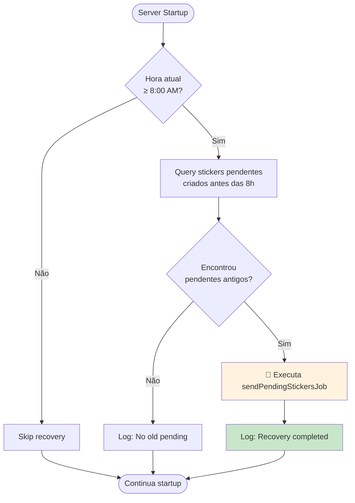
```mermaid
flowchart TD
    START([Server Startup]) --> CHECK_TIME{Hora atual<br/>≥ 8:00 AM?}

    CHECK_TIME -->|Não| SKIP[Skip recovery]
    CHECK_TIME -->|Sim| QUERY[Query stickers pendentes<br/>criados antes das 8h]

    QUERY --> HAS_OLD{Encontrou<br/>pendentes antigos?}

    HAS_OLD -->|Não| LOG_CLEAN[Log: No old pending]
    HAS_OLD -->|Sim| RUN_JOB[🔄 Executa sendPendingStickersJob]

    RUN_JOB --> LOG_RECOVERY[Log: Recovery completed]

    SKIP --> END([Continua startup])
    LOG_CLEAN --> END
    LOG_RECOVERY --> END

    style RUN_JOB fill:#fff3e0
    style LOG_RECOVERY fill:#c8e6c9
```

---

## 20. Text Message Strategy - Conversão Silenciosa

**Status**: ✅ ATIVO

```mermaid
flowchart TD
    START([Texto recebido]) --> IS_CMD{É comando<br/>reconhecido?}

    IS_CMD -->|Sim| PROCESS_CMD[Processa comando]
    IS_CMD -->|Não| CHECK_USER{Tipo de<br/>usuário?}

    CHECK_USER -->|Novo step=0| WELCOME[📨 Welcome message]
    CHECK_USER -->|Limite atingido| UPGRADE[📨 Upgrade menu]
    CHECK_USER -->|Com quota| SILENT[🤐 Ignora silenciosamente]

    PROCESS_CMD --> END([Fim])
    WELCOME --> END
    UPGRADE --> END
    SILENT --> END

    style SILENT fill:#e3f2fd
    style UPGRADE fill:#fff3e0
    style WELCOME fill:#e8f5e9
```

**Lógica (webhook.ts:1021-1229):**
```typescript
// Texto não é comando conhecido
if (!isCommand) {
  if (user.onboarding_step === 0) {
    // Novo usuário → Welcome (engajamento)
    await sendWelcomeMessage(userNumber, user.name);
  } else if (user.daily_count >= user.daily_limit) {
    // Limite atingido → Upgrade menu (conversão)
    await sendLimitReachedMenu(userNumber, user);
  } else {
    // Com quota → Silencioso (não perturba)
    // Apenas log, sem resposta
    logger.debug({ msg: 'Ignored non-command text', userNumber });
  }
}
```

**Objetivos:**
1. ✅ Não spammar usuários ativos
2. ✅ Engajar novos usuários
3. ✅ Converter usuários no limite
4. ✅ Experiência limpa

---

## 21. Bonus Credits Flow Completo

**Status**: ✅ ATIVO

```mermaid
sequenceDiagram
    autonumber
    participant U as 👤 Usuário
    participant B as ⚙️ Backend
    participant DB as 🗄️ Supabase
    participant W as 📱 WhatsApp

    Note over U,DB: 🎁 BONUS FLOW: Grupo Bonus (A/B Test)

    U->>B: Envia imagem (daily_count = 4)
    B->>DB: Check: daily_count >= daily_limit?
    DB-->>B: Sim, limite atingido

    B->>DB: Check: ab_test_group?
    DB-->>B: ab_test_group = 'bonus'

    B->>DB: Check: bonus_credits_today?
    DB-->>B: bonus_credits_today = 0 (disponível)

    B->>W: Botões interativos
    Note right of W: ⚠️ Limite Atingido!<br/><br/>🎁 Usar Bônus (+2)<br/>💰 Premium<br/>🚀 Ultra

    U->>B: Clica "🎁 Usar Bônus"

    B->>DB: UPDATE users SET<br/>bonus_credits_today = 1<br/>WHERE whatsapp_number = ?<br/>AND bonus_credits_today < 2

    alt Update bem-sucedido
        DB-->>B: 1 row affected
        B->>W: ✅ "Você ganhou +2 figurinhas extras!"

        Note over U: Usuário pode enviar 2 imagens extras

        U->>B: Envia imagem (usa 1º bônus)
        B->>B: Processa normalmente
        B->>W: Envia sticker

        U->>B: Envia imagem (usa 2º bônus)
        B->>B: Processa normalmente
        B->>W: Envia sticker

        U->>B: Envia imagem (bônus esgotado)
        B->>DB: Check: bonus_credits_today?
        DB-->>B: bonus_credits_today = 2 (limite)

        B->>W: Botões (sem bônus desta vez)
        Note right of W: ⚠️ Limite Atingido!<br/><br/>💰 Premium<br/>🚀 Ultra<br/>❌ Agora Não
    else Condição de corrida (outro processo usou)
        DB-->>B: 0 rows affected
        B->>W: ❌ "Bônus já utilizado"
    end

    Note over DB: 🌙 Meia-noite: Reset automático
    DB->>DB: UPDATE users SET<br/>daily_count = 0,<br/>bonus_credits_today = 0
```

**Validação Atômica:**
```typescript
const result = await supabase
  .from('users')
  .update({ bonus_credits_today: user.bonus_credits_today + 1 })
  .eq('whatsapp_number', userNumber)
  .lt('bonus_credits_today', 2) // Atomic check
  .select();

if (result.data.length === 0) {
  // Condição de corrida ou já usou
  await sendText(userNumber, 'Bônus já utilizado');
}
```

---

---

## 22. Fluxo A/B Test - Message Variants (upgrade_message_v1)

**Status**: 🚧 PAUSADO (11/01/2026)

> ⚠️ **EXPERIMENTO PAUSADO**: Pausado para dar lugar ao experimento de limite diário.
> - Variante `social_proof` teve melhor desempenho (12% click rate vs 1.2% control)
> - Dados preservados para análise futura
> - Ver seção 23 para experimento ativo

```mermaid
flowchart TD
    START([Usuário atinge limite]) --> GET_VARIANT[Busca variante do experimento]

    GET_VARIANT --> CHECK_BR{Número<br/>brasileiro?}

    CHECK_BR -->|Não +55| CONTROL_INT[Força variante: control]
    CHECK_BR -->|Sim +55| ASSIGN{Variante<br/>atribuída?}

    ASSIGN -->|Não| RANDOM[Sorteia variante por peso]
    ASSIGN -->|Sim| USE_EXISTING[Usa variante existente]

    RANDOM --> SAVE_DB[Salva em experiment_assignments]
    SAVE_DB --> LOAD_CONFIG

    USE_EXISTING --> LOAD_CONFIG[Carrega config da variante]
    CONTROL_INT --> LOAD_CONFIG

    LOAD_CONFIG --> RENDER[Renderiza mensagem com placeholders]

    subgraph VARIANTS["📝 Variantes de Mensagem"]
        V1["🔵 control (25%)<br/>Mensagem original com 5 emojis"]
        V2["🟢 social_proof (25%)<br/>'Mais de 150 pessoas fizeram upgrade...' 😊"]
        V3["🟣 benefit (25%)<br/>'Com Premium você teria +16 hoje...' ✨"]
        V4["🟡 hybrid (25%)<br/>'Usuários Premium criam em média 12...' 🎨"]
    end

    RENDER --> SEND_MSG[Envia mensagem + botões]

    SEND_MSG --> LOG_SHOWN[Log: menu_shown]

    LOG_SHOWN --> USER_ACTION{Ação do<br/>usuário?}

    USER_ACTION -->|Dismiss| LOG_DISMISS[Log: dismiss_clicked]
    USER_ACTION -->|Premium/Ultra| LOG_UPGRADE[Log: upgrade_clicked]

    LOG_UPGRADE --> PAYMENT{Método?}
    PAYMENT -->|PIX/Card/Boleto| LOG_PAYMENT[Log: payment_started]
    LOG_PAYMENT --> PAID{Pagou?}
    PAID -->|Sim| LOG_CONVERTED[Log: converted]

    LOG_DISMISS --> END([Fim])
    LOG_CONVERTED --> END

    style V1 fill:#bbdefb
    style V2 fill:#c8e6c9
    style V3 fill:#e1bee7
    style V4 fill:#fff9c4
```

**Placeholders Disponíveis:**
| Placeholder | Descrição | Exemplo |
|-------------|-----------|---------|
| `{count}` | Stickers usados hoje | 4 |
| `{limit}` | Limite do plano | 4 |
| `{feature}` | Nome da feature | figurinhas |
| `{emoji}` | Emoji do plano | 🎨 |
| `{userName}` | Nome do usuário | João |

**Eventos Rastreados:**
- `menu_shown` - Menu de upgrade exibido
- `dismiss_clicked` - Clicou em fechar/depois
- `upgrade_clicked` - Clicou em Premium/Ultra
- `payment_started` - Iniciou pagamento (PIX/Card/Boleto)
- `converted` - Pagamento confirmado

**Dashboard:** `/admin-panel/analytics/experiments`

---

---

## 23. Fluxo A/B Test - Limite Diário (daily_limit_v1)

**Status**: ✅ ATIVO

```mermaid
flowchart TD
    START([Novo usuário cadastrado]) --> TRIGGER[Trigger: assign_limit_variant]

    TRIGGER --> RANDOM{Sorteia<br/>variante}

    RANDOM -->|34%| LIMIT_4["limit_4<br/>4 stickers/dia"]
    RANDOM -->|33%| LIMIT_3["limit_3<br/>3 stickers/dia"]
    RANDOM -->|33%| LIMIT_2["limit_2<br/>2 stickers/dia"]

    LIMIT_4 --> SAVE_DB[Salva em users.daily_limit]
    LIMIT_3 --> SAVE_DB
    LIMIT_2 --> SAVE_DB

    SAVE_DB --> USE_LIMIT[Limite usado no RPC atômico]

    subgraph RPC["⚡ check_and_increment_daily_limit_atomic"]
        R1[Lê users.daily_limit]
        R2[Compara com daily_count]
        R3{daily_count >= daily_limit?}

        R1 --> R2 --> R3
        R3 -->|Sim| BLOCKED[Bloqueia + menu upgrade]
        R3 -->|Não| ALLOWED[Permite + incrementa]
    end

    USE_LIMIT --> R1

    BLOCKED --> LOG_LIMIT[Log: limit_reached]
    ALLOWED --> LOG_STICKER[Log: sticker_created]

    LOG_LIMIT --> TRACK_METRICS
    LOG_STICKER --> TRACK_METRICS

    subgraph TRACK_METRICS["📊 Métricas Rastreadas"]
        M1[Conversão por variante]
        M2[Retenção D1/D7/D30]
        M3[Stickers criados por variante]
        M4[Revenue por variante]
    end

    style LIMIT_4 fill:#c8e6c9
    style LIMIT_3 fill:#fff9c4
    style LIMIT_2 fill:#ffcdd2
```

**Objetivo:**
Descobrir o limite diário ideal para usuários free que maximize:
1. **Conversão** - % que faz upgrade para Premium/Ultra
2. **Retenção** - % que volta no D1, D7, D30

**Estrutura do Banco:**
```sql
-- Tabela users (colunas SEM DEFAULT para trigger funcionar)
ALTER TABLE users ADD COLUMN daily_limit INTEGER;
ALTER TABLE users ADD COLUMN limit_experiment_variant TEXT;

-- Trigger para novos usuários (atribui variante aleatória)
CREATE TRIGGER assign_limit_on_insert
  BEFORE INSERT ON users
  FOR EACH ROW
  EXECUTE FUNCTION assign_limit_variant();
```

> **Nota:** As colunas `daily_limit` e `limit_experiment_variant` NÃO têm DEFAULT.
> Isso é intencional - o PostgreSQL aplica defaults ANTES do trigger BEFORE INSERT,
> então sem DEFAULT o trigger recebe NULL e consegue atribuir a variante corretamente.

**Distribuição:**
| Variante | Limite | % Tráfego | Descrição |
|----------|--------|-----------|-----------|
| `limit_4` | 4/dia | 34% | Controle (limite atual) |
| `limit_3` | 3/dia | 33% | Limite reduzido |
| `limit_2` | 2/dia | 33% | Limite agressivo |

**Grandfathering:**
- 475 usuários existentes (até 11/01/2026) mantêm `limit_4`
- Novos usuários a partir de 12/01/2026 entram no experimento com variantes aleatórias
- Possibilidade futura de migrar usuários antigos

**Queries de Análise:**
```sql
-- Conversão por variante
SELECT
  limit_experiment_variant,
  COUNT(*) as total_users,
  COUNT(*) FILTER (WHERE subscription_plan != 'free') as converted,
  ROUND(100.0 * COUNT(*) FILTER (WHERE subscription_plan != 'free') / COUNT(*), 2) as conversion_rate
FROM users
GROUP BY limit_experiment_variant;

-- Retenção D7 por variante
SELECT
  limit_experiment_variant,
  COUNT(DISTINCT user_number) as users_d7_active
FROM usage_logs
WHERE created_at > NOW() - INTERVAL '7 days'
GROUP BY limit_experiment_variant;
```

**Código Relevante:**
- `src/services/subscriptionService.ts:getUserLimits()` - Retorna limite do usuário
- `check_and_increment_daily_limit_atomic` - RPC que usa `users.daily_limit`
- Trigger `assign_limit_variant()` - Atribui variante a novos usuários

**Mensagens Dinâmicas (Atualizado 11/01/2026):**

Todas as mensagens user-facing agora respeitam o limite dinâmico do usuário (`users.daily_limit`).
As seguintes funções foram atualizadas para receber o parâmetro `userDailyLimit`:

| Arquivo | Função | Exemplo de Uso |
|---------|--------|----------------|
| `menuService.ts` | `sendPlansListMenu(userNumber, userDailyLimit)` | Plano gratuito: {limit} figurinhas/dia |
| `menuService.ts` | `getPlansOverviewMenu(userDailyLimit)` | 🆓 Gratuito - {limit}/dia |
| `menuService.ts` | `getPlanDetailsMenu(plan, userDailyLimit)` | Comparação free vs premium |
| `menuService.ts` | `getWelcomeMessageForNewUser(userName, userDailyLimit)` | Seu plano: {limit} figurinhas/dia |
| `onboardingService.ts` | `checkTwitterFeaturePresentation(userNumber, userName, currentStep, stickerCount)` | Trigger após N figurinhas |
| `onboardingService.ts` | `sendTwitterFeaturePresentation(userNumber, userName, stickerCount)` | 🎉 Você já criou {count} figurinhas! |
| `onboardingService.ts` | `handleTwitterLearnMore(userNumber, userName, userDailyLimit)` | ✨ Seu plano gratuito: {limit} vídeos/dia |
| `sendScheduledReminders.ts` | Usa `user.daily_limit ?? PLAN_LIMITS.free` | Limite correto para cada usuário |

**Chamadas no webhook.ts:**
```typescript
// Todos os callsites passam user.daily_limit ?? 4
await sendPlansListMenu(userNumber, user.daily_limit ?? 4);
const welcomeMsg = getWelcomeMessageForNewUser(user.name, user.daily_limit ?? 4);
await handleTwitterLearnMore(userNumber, user.name, user.daily_limit ?? 4);
```

Isso garante que usuários com `limit_2` vejam "2 figurinhas/dia", usuários com `limit_3` vejam "3 figurinhas/dia", etc.

---

## 15. Arquitetura RPC Type-Safe

**Status:** ✅ ATIVO (Sprint 14 concluída em 12/01/2026)

### Problema Resolvido

Bugs de RPC causaram downtime em produção:
- Código confundia retorno SCALAR vs TABLE
- Sem validação de tipos em compile time
- Fácil usar `supabase.rpc()` com tipo errado

### Solução

```
┌─────────────────────────────────────────────────────────────┐
│                  RPC TYPE-SAFE ARCHITECTURE                  │
├─────────────────────────────────────────────────────────────┤
│                                                              │
│   src/rpc/                                                  │
│   ├── registry.ts   → Single source of truth (14 funções)  │
│   ├── client.ts     → Função rpc() type-safe               │
│   ├── types.ts      → Interfaces de retorno                │
│   └── errors.ts     → Classes de erro padronizadas         │
│                                                              │
└─────────────────────────────────────────────────────────────┘
```

### Proteções em Camadas

| Camada | Proteção | Quando |
|--------|----------|--------|
| TypeScript | Tipos inferidos do registry | Compile time |
| ESLint | Bloqueia `supabase.rpc()` direto | CI |
| Runtime | Valida SCALAR vs TABLE | Execução |
| Testes | Valida registry sincronizado | CI |

### Uso Correto

```typescript
// ❌ BLOQUEADO pelo ESLint
const { data } = await supabase.rpc('increment_daily_count', {...});

// ✅ CORRETO
import { rpc } from '../rpc';
const count = await rpc('increment_daily_count', { p_user_id: userId });
// TypeScript sabe que count é number
```

### Código Relevante
- `src/rpc/` - Módulo completo
- `.eslintrc.json` - Regra `no-restricted-syntax`
- `.github/workflows/ci.yml` - CI pipeline
- `tests/rpc/rpc.test.ts` - Testes de sync

**Documentação completa:** [Sprint 14 - RPC Type-Safe](../sprints/SPRINT-14-RPC-TYPE-SAFE.md)

---

**Última atualização:** 12/01/2026 - Sprint 14 concluída (RPC type-safe), CI pipeline adicionado, corrigido bug do experimento de limite diário

