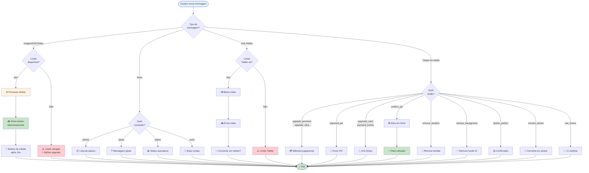
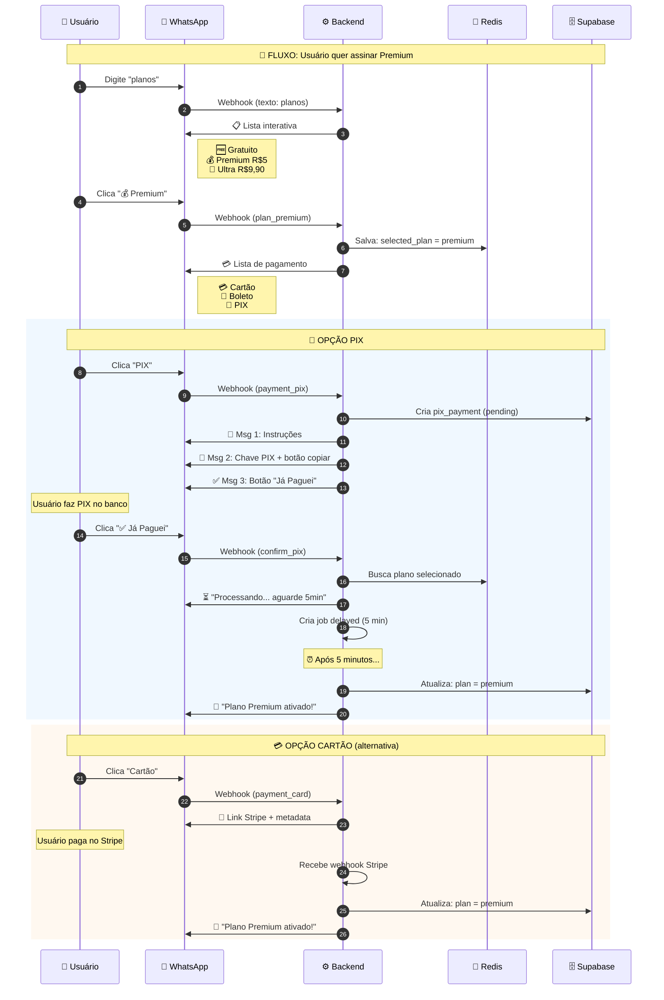
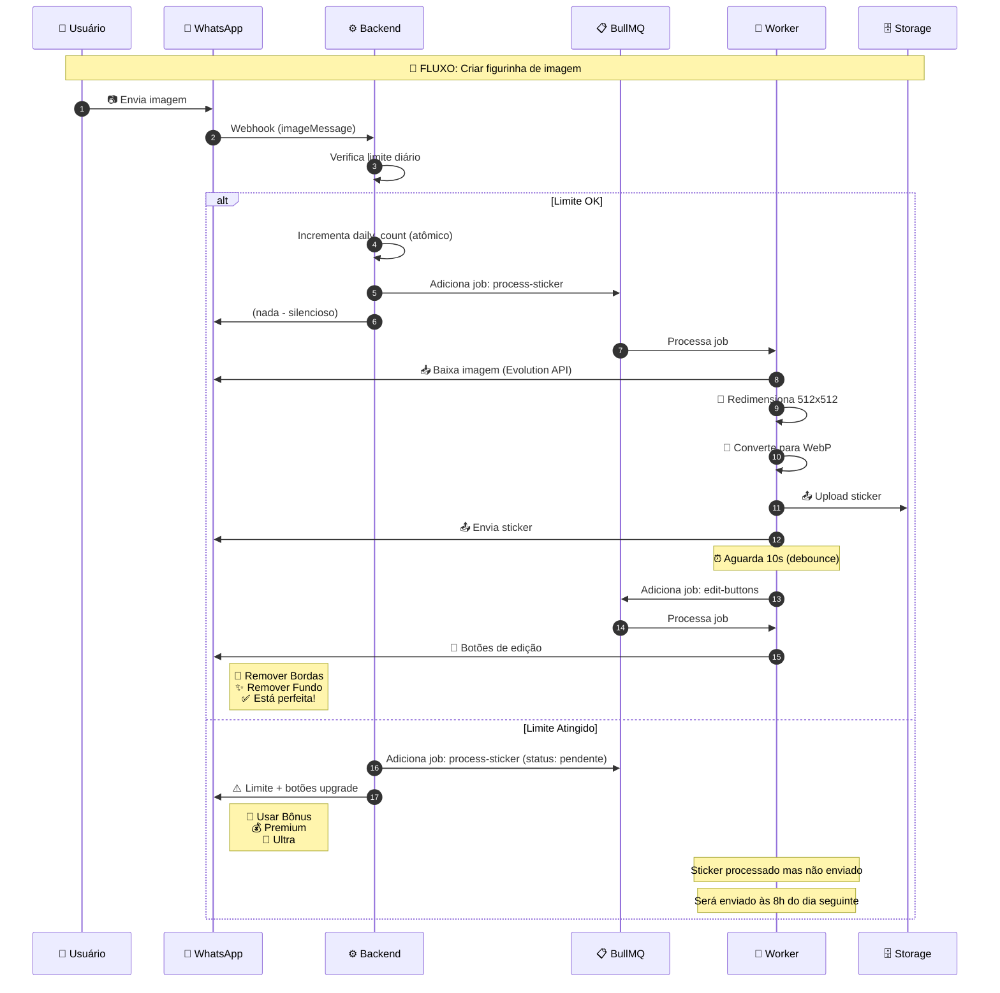
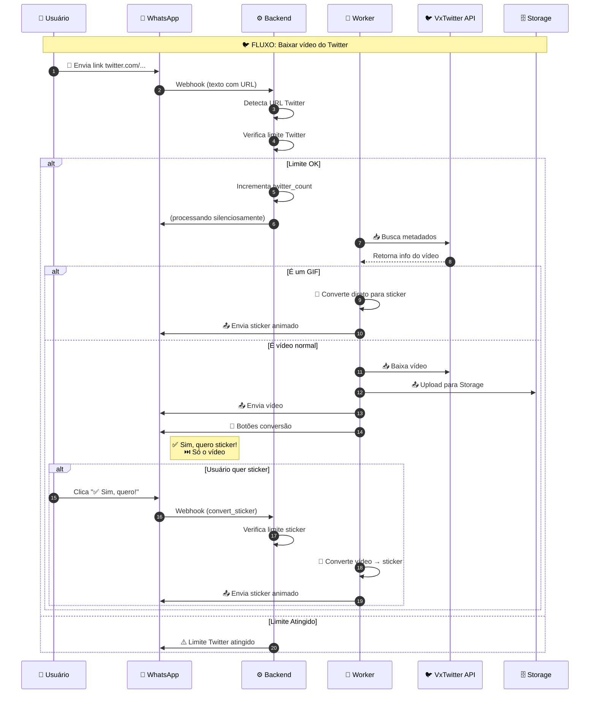
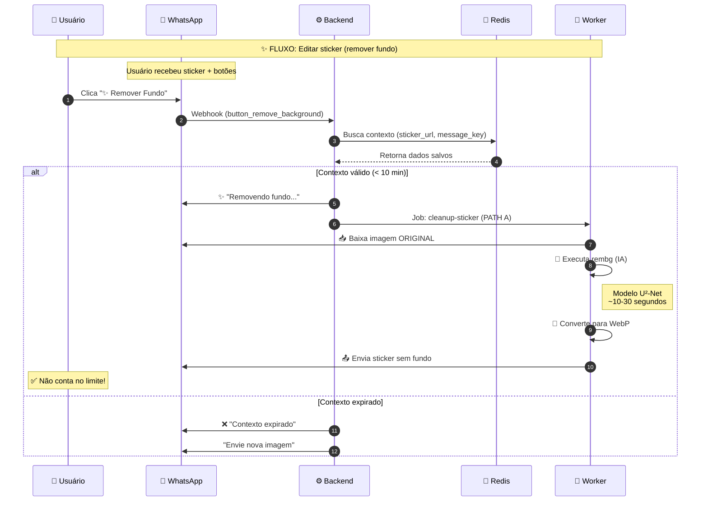
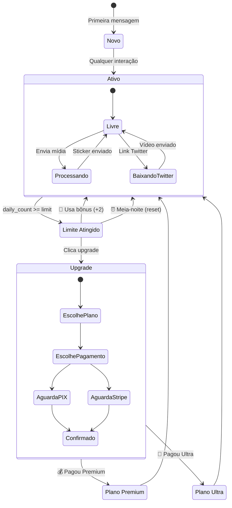
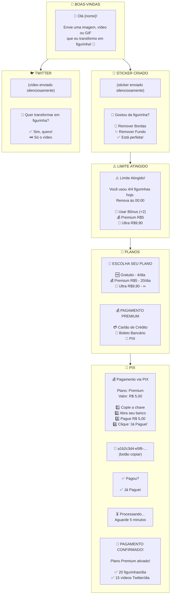
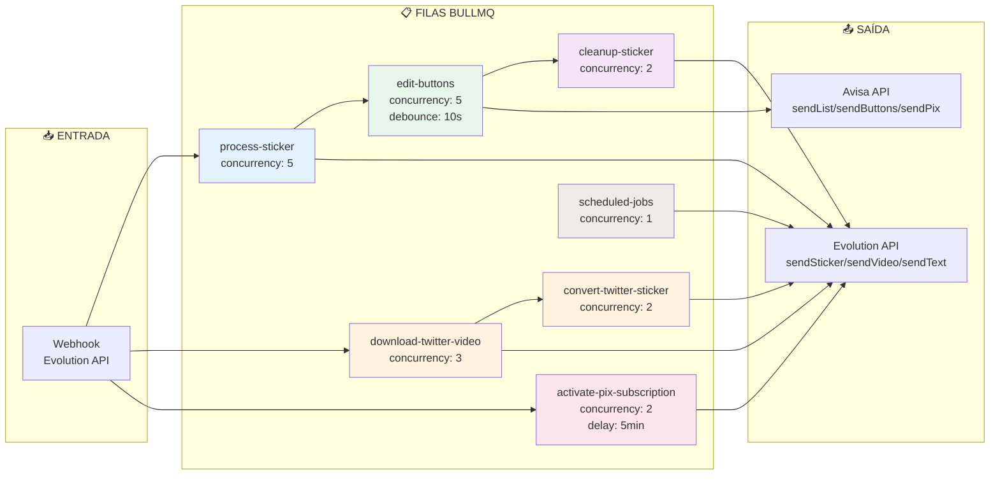

# 🗺️ StickerBot - Fluxos Visuais

Diagramas interativos do funcionamento do bot.

---

## 1. Fluxo Principal do Usuário

---

## 2. Fluxo de Assinatura Completo

---

## 3. Fluxo de Criação de Sticker

---

## 4. Fluxo de Download Twitter

---

## 5. Fluxo de Edição de Sticker

---

## 6. Estados do Usuário

---

## 7. Mapa de Mensagens

---

## 8. Arquitetura de Filas

---

**Última atualização:** 08/01/2026
