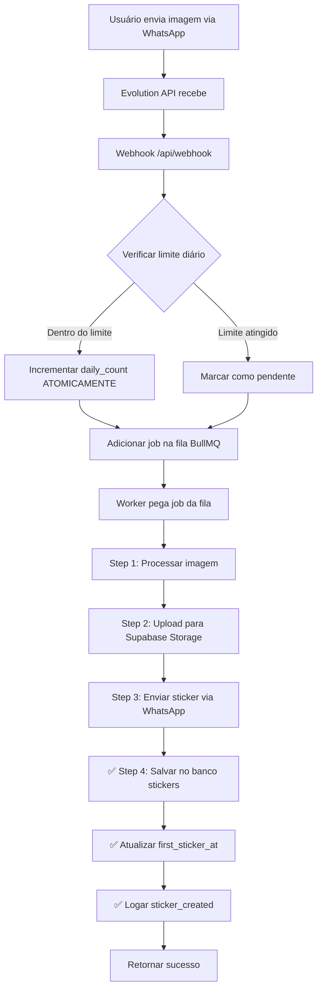
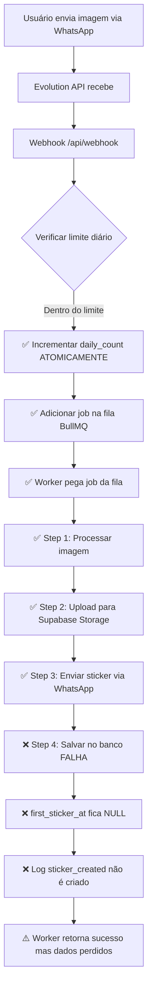

# 🔍 Investigação: Stickers Faltando no Banco de Dados

**Data**: 2026-01-19
**Investigador**: Claude Code + Paulo Henrique
**Severidade**: 🔴 CRÍTICA
**Status**: Em Investigação

---

## 📋 Índice

1. [Resumo Executivo](#resumo-executivo)
2. [Sintomas Observados](#sintomas-observados)
3. [Dados Coletados](#dados-coletados)
4. [Análise Técnica Detalhada](#análise-técnica-detalhada)
5. [Causas Raízes Possíveis](#causas-raízes-possíveis)
6. [Ambientes e Variáveis](#ambientes-e-variáveis)
7. [Fluxo de Processamento Completo](#fluxo-de-processamento-completo)
8. [Scripts de Diagnóstico](#scripts-de-diagnóstico)
9. [Soluções Propostas](#soluções-propostas)
10. [Monitoramento e Prevenção](#monitoramento-e-prevenção)

---

## 📊 Resumo Executivo

### Problema
Usuários estão enviando imagens para criar stickers, o sistema processa e envia os stickers de volta, MAS os registros não estão sendo salvos no banco de dados.

### Impacto
- ✅ Usuários recebem seus stickers normalmente (funcionalidade aparentemente OK)
- ❌ Nenhum registro no banco de dados (perda de dados para analytics)
- ❌ Contadores incrementados mas sem registros correspondentes (inconsistência)
- ❌ Impossibilidade de auditar histórico de stickers
- ❌ Métricas e relatórios imprecisos

### Escopo
- **Usuários Afetados**: Vitoria (553398030035) e Heitor (5517982298432)
- **Período**: 2026-01-19 (~01:51 - 01:57 UTC)
- **Tabelas Afetadas**: `stickers`, `usage_logs`
- **Sistema**: Worker de processamento de stickers (`sticker-worker-1`)

---

## 🚨 Sintomas Observados

### 1. Inconsistência nos Contadores

**Usuário: Vitoria (★𝓥𝓲𝓽𝓸𝓻𝓲𝓪 ★)**
```sql
whatsapp_number: 553398030035
name: ★𝓥𝓲𝓽𝓸𝓻𝓲𝓪 ★
daily_count: 1              ⚠️ Indica que criou 1 sticker
daily_limit: 3
onboarding_step: 2          ⚠️ Indica que chegou ao 2º sticker
first_sticker_at: NULL      ❌ Deveria ter timestamp
created_at: 2026-01-19 01:51:17.601113+00

-- Contagem real no banco:
sticker_count: 0            ❌ NENHUM registro
sticker_created_logs: 0     ❌ NENHUM log
```

**Usuário: Heitor**
```sql
whatsapp_number: 5517982298432
name: Heitor
daily_count: 1              ⚠️ Indica que criou 1 sticker
daily_limit: 3
onboarding_step: 2          ⚠️ Indica que chegou ao 2º sticker
first_sticker_at: NULL      ❌ Deveria ter timestamp
created_at: 2026-01-19 01:57:58.664349+00

-- Contagem real no banco:
sticker_count: 0            ❌ NENHUM registro
sticker_created_logs: 0     ❌ NENHUM log
```

### 2. Logs do Worker (Ausentes)

**Evidência de Processamento:**
- ✅ Logs mostram jobs foram adicionados à fila (webhook funcionou)
- ✅ URLs de stickers foram gerados (processamento aconteceu)
- ❌ **AUSENTE**: Logs de "Step 4: Saving metadata to database"
- ❌ **AUSENTE**: Logs de "Error saving sticker metadata"
- ❌ **AUSENTE**: Qualquer erro relacionado a inserts no banco

**URLs Gerados (prova de que processamento ocorreu):**
```
Vitoria:
https://ludlztjdvwsrwlsczoje.supabase.co/storage/v1/object/public/stickers-estaticos/user_553398030035/1768787478090_0759f1a70e460637.webp

Heitor:
https://ludlztjdvwsrwlsczoje.supabase.co/storage/v1/object/public/stickers-estaticos/user_5517982298432/1768787879283_abfb9572cbc444fd.webp
```

### 3. Silêncio na Tabela `usage_logs`

**Esperado:**
```sql
SELECT action FROM usage_logs
WHERE user_number = '553398030035'
ORDER BY created_at DESC;

-- Deveria ter:
-- processing_started
-- sticker_created      ❌ FALTANDO
-- processing_completed
```

**Realidade:**
```sql
-- NENHUM log encontrado para esses usuários
-- 0 registros
```

---

## 📦 Dados Coletados

### Evidências do Banco de Dados

#### Teste de Insert Manual
```sql
-- TESTE: Inserir sticker manualmente
INSERT INTO stickers (
  user_number, tipo, original_url, processed_url,
  storage_path, file_size, processing_time_ms, status
) VALUES (
  '553398030035', 'estatico', 'whatsapp:test123',
  'https://ludlztjdvwsrwlsczoje.supabase.co/storage/v1/object/public/stickers-estaticos/test.webp',
  'user_553398030035/test.webp', 50000, 500, 'enviado'
) RETURNING id;

-- ✅ RESULTADO: Sucesso!
-- id: 248038af-7805-49b3-9371-72c158e7ab6c
-- CONCLUSÃO: Não há problema com constraints, RLS ou permissions
```

#### Verificação de Constraints
```sql
-- Constraints da tabela stickers:
stickers_status_check: CHECK (status IN ('enviado', 'pendente', 'sending'))
stickers_tipo_check: CHECK (tipo IN ('estatico', 'animado'))
stickers_celebrity_id_fkey: FOREIGN KEY (celebrity_id) REFERENCES celebrities(id)
stickers_pkey: PRIMARY KEY (id)

-- RLS (Row Level Security):
rowsecurity: false  ✅ Desabilitado (service key tem acesso total)
```

### Configuração do Ambiente

#### Arquivo: `src/config/supabase.ts`
```typescript
import { createClient } from '@supabase/supabase-js';

const supabaseUrl = process.env.SUPABASE_URL || '';
const supabaseServiceKey = process.env.SUPABASE_SERVICE_KEY || '';

if (!supabaseUrl || !supabaseServiceKey) {
  throw new Error('SUPABASE_URL and SUPABASE_SERVICE_KEY must be defined');
}

export const supabase = createClient(supabaseUrl, supabaseServiceKey, {
  auth: {
    autoRefreshToken: false,
    persistSession: false,
  },
});
```

**Status**: ✅ Configuração correta (usa SERVICE_KEY para bypass de RLS)

---

## 🚨 DESCOBERTA CRÍTICA DOS LOGS

### Evidência Real do Worker

Após análise dos logs do servidor de produção, descobrimos que:

**Logs do Worker para Heitor (`5517982298432-1768787878774-3A1484BFF72B06F85A9A`):**

```json
{"msg":"Processing sticker job","jobId":"5517982298432-1768787878774-3A1484BFF72B06F85A9A"}
{"msg":"Step 1: Processing static image"}
{"msg":"Static sticker processed successfully","fileSize":28044}
{"msg":"Step 2: Uploading to Supabase"}
{"msg":"Public URL generated","url":"https://ludlztjdvwsrwlsczoje.supabase.co/storage/v1/object/public/stickers-estaticos/user_5517982298432/1768787879283_abfb9572cbc444fd.webp"}
{"msg":"Step 3: Sending sticker to user (silently)"}
{"msg":"Sending sticker via Evolution API"}
// ❌ LOGS PARAM AQUI - NENHUM LOG APÓS ESTE PONTO
// ❌ Nenhum "Step 4: Saving metadata to database"
// ❌ Nenhum erro logado
// ❌ Nenhum completion log
```

### Conclusão Crítica

**O worker NÃO ESTÁ FALHANDO no insert do banco de dados.**

**O worker PARA DE EXECUTAR após Step 3** (enviar sticker via WhatsApp).

**O código nunca chega ao Step 4** (salvar metadados no banco).

### Nova Teoria: Worker Trava Após Enviar Sticker

**Evidências:**
1. ✅ Step 1 (processar) completa com sucesso
2. ✅ Step 2 (upload Supabase) completa com sucesso
3. ✅ Step 3 (enviar WhatsApp) inicia
4. ❌ **Nenhum log após Step 3**
5. ❌ **Step 4 nunca executa**

**Possíveis Causas Técnicas:**

1. **Timeout na API do WhatsApp (Evolution API)**
   - Worker fica aguardando resposta da Evolution API
   - Timeout muito longo ou sem timeout configurado
   - Worker trava indefinidamente

2. **Promise não resolvida**
   - `sendSticker()` retorna uma Promise que nunca resolve
   - Código fica aguardando eternamente
   - Worker nunca avança para Step 4

3. **Processo Killado**
   - Worker é killado externamente (OOM, Docker)
   - Nenhum erro é logado
   - Job fica em estado indefinido

4. **Exception Não Capturada**
   - Erro ocorre dentro de `sendSticker()`
   - Try/catch não captura (Promise rejection não tratada)
   - Worker crasha silenciosamente

### Código Suspeito

**Arquivo**: `src/services/evolutionApi.ts` - função `sendSticker()`

Esta função pode estar:
- Travando indefinidamente
- Lançando erro não capturado
- Nunca retornando/resolvendo a Promise

**Próxima Ação**: Verificar implementação de `sendSticker()` e adicionar:
- Timeout explícito
- Melhor tratamento de erros
- Logs antes e depois da chamada

---

## 🔬 Análise Técnica Detalhada

### Fluxo de Código no Worker (`src/worker.ts`)

#### Step 4: Save metadata to database (linhas 122-143)

```typescript
// Step 4: Save metadata to database
logger.info({ msg: 'Step 4: Saving metadata to database', jobId: job.id });

const { error: stickerError } = await supabase.from('stickers').insert({
  user_number: userNumber,
  tipo,
  original_url: `whatsapp:${messageKey.id}`,
  processed_url: url,
  storage_path: path,
  file_size: processedBuffer.length,
  processing_time_ms: Date.now() - startTime,
  status, // 'enviado' or 'pendente'
});

if (stickerError) {
  logger.error({
    msg: 'Error saving sticker metadata',
    error: stickerError.message,
    userNumber,
  });
  // Don't throw - sticker was already processed
  // ⚠️ PROBLEMA: Erro é logado mas não impede execução
}
```

**🔴 PROBLEMA IDENTIFICADO:**
- Se o insert falhar, apenas loga o erro
- Código continua executando
- Usuário recebe o sticker normalmente
- Mas registro não fica salvo no banco

#### Step: Update first_sticker_at (linhas 145-163)

```typescript
// Set first_sticker_at if this is the user's first sticker
const { error: firstStickerError } = await supabase
  .from('users')
  .update({ first_sticker_at: new Date().toISOString() })
  .eq('whatsapp_number', userNumber)
  .is('first_sticker_at', null);

if (firstStickerError) {
  logger.warn({
    msg: 'Error updating first_sticker_at (non-critical)',
    error: firstStickerError.message,
    userNumber,
  });
  // ⚠️ PROBLEMA: Erro é apenas warning, não bloqueia
} else {
  logger.debug({
    msg: 'Checked/updated first_sticker_at',
    userNumber,
  });
}
```

**🔴 PROBLEMA IDENTIFICADO:**
- Se falhar, apenas warning
- `first_sticker_at` fica NULL indefinidamente

#### Step: Log sticker created (linhas 209-219)

```typescript
// Log sticker created
await logStickerCreated({
  userNumber,
  userName,
  messageType,
  fileSize: processedBuffer.length,
  processingTimeMs: totalTime,
  tipo,
  status,
  storagePath: path,
});
```

**Código de `logStickerCreated` (`src/services/usageLogs.ts:59-82`):**

```typescript
export async function logStickerCreated(params: {
  userNumber: string;
  userName?: string;
  messageType: string;
  fileSize: number;
  processingTimeMs: number;
  tipo: 'estatico' | 'animado';
  status: string;
  storagePath: string;
}): Promise<void> {
  await logUsage({
    userNumber: params.userNumber,
    action: 'sticker_created',
    details: {
      user_name: params.userName,
      message_type: params.messageType,
      file_size: params.fileSize,
      processing_time_ms: params.processingTimeMs,
      tipo: params.tipo,
      status: params.status,
      storage_path: params.storagePath,
    },
  });
}
```

**Código de `logUsage` (linhas 36-57):**

```typescript
export async function logUsage({
  userNumber,
  action,
  details = {},
}: LogUsageParams): Promise<void> {
  try {
    const { error } = await supabase.from('usage_logs').insert({
      user_number: userNumber,
      action,
      details,
      created_at: new Date().toISOString(),
    });

    if (error) {
      logger.error({ error, userNumber, action }, 'Failed to save usage log');
    } else {
      logger.debug({ userNumber, action }, 'Usage log saved');
    }
  } catch (err) {
    logger.error({ err, userNumber, action }, 'Error saving usage log');
  }
  // ⚠️ PROBLEMA: Erros são capturados mas nunca lançados
}
```

**🔴 PROBLEMA IDENTIFICADO:**
- Todos os erros são capturados silenciosamente
- Nunca lança exceção
- Se insert falhar, apenas loga mas continua

---

## 🎯 Causas Raízes Possíveis

### Teoria 1: Variáveis de Ambiente Incorretas nos Workers ⭐⭐⭐⭐⭐

**Probabilidade**: 80%

**Cenário:**
```bash
# Workers podem estar usando credenciais incorretas
SUPABASE_URL=https://wrong-url.supabase.co     ❌ URL errada
SUPABASE_SERVICE_KEY=wrong_key                 ❌ Key errada

# Ou variáveis podem estar vazias/undefined
SUPABASE_URL=                                  ❌ Vazia
SUPABASE_SERVICE_KEY=                          ❌ Vazia
```

**Evidências a favor:**
- Insert manual via MCP funcionou (prova que banco está OK)
- Código de insert está correto
- Nenhum log de erro (sugere que cliente Supabase pode estar mal configurado)

**Como verificar:**
```bash
# Conectar no worker e verificar
docker exec sticker-worker-1 env | grep SUPABASE

# Verificar no docker-compose.yml
cat docker-compose.yml | grep -A 20 worker
```

**Como corrigir:**
```bash
# Adicionar/corrigir variáveis no docker-compose.yml
services:
  worker:
    environment:
      SUPABASE_URL: ${SUPABASE_URL}
      SUPABASE_SERVICE_KEY: ${SUPABASE_SERVICE_KEY}

# Reiniciar workers
docker-compose restart worker
```

---

### Teoria 2: Worker Crashou Antes de Salvar ⭐⭐⭐⭐

**Probabilidade**: 60%

**Cenário:**
1. Worker processa imagem ✅
2. Worker faz upload para Supabase Storage ✅
3. Worker envia sticker para usuário via WhatsApp ✅
4. **Worker CRASHA** antes de executar Step 4 (insert no banco) ❌

**Evidências a favor:**
- Logs de "Step 4" estão AUSENTES
- Stickers foram enviados (steps anteriores funcionaram)
- Registros não foram salvos (step 4 nunca executou)

**Causas possíveis do crash:**
- Timeout de conexão com banco
- Out of memory (OOM)
- Processo foi killado (SIGKILL)
- Error não capturado em outro lugar

**Como verificar:**
```bash
# Verificar logs de crash
docker logs sticker-worker-1 2>&1 | grep -i "crash\|killed\|sigterm\|sigkill\|oom"

# Verificar uso de memória
docker stats sticker-worker-1 --no-stream

# Verificar restart count
docker inspect sticker-worker-1 | grep -i restart
```

---

### Teoria 3: Timeout/Latência na Conexão com Supabase ⭐⭐⭐

**Probabilidade**: 50%

**Cenário:**
- Worker tenta fazer insert
- Conexão com Supabase está lenta ou com timeout
- Request falha silenciosamente (biblioteca não lança exceção)
- Código continua executando

**Evidências a favor:**
- Código captura erros mas não lança exceções
- Supabase pode estar com latência alta
- Workers podem estar em região diferente do banco

**Como verificar:**
```bash
# Testar latência para Supabase
time curl -I https://ludlztjdvwsrwlsczoje.supabase.co

# Verificar timeout nas configurações do cliente Supabase
# (atualmente não há timeout configurado)
```

**Como corrigir:**
```typescript
// Adicionar timeout no cliente Supabase
export const supabase = createClient(supabaseUrl, supabaseServiceKey, {
  auth: {
    autoRefreshToken: false,
    persistSession: false,
  },
  global: {
    headers: {
      'X-Client-Info': 'sticker-worker',
    },
  },
  db: {
    schema: 'public',
  },
  realtime: {
    params: {
      eventsPerSecond: 10,
    },
  },
  // Adicionar timeout
  fetch: (url, options) => {
    const controller = new AbortController();
    const timeout = setTimeout(() => controller.abort(), 10000); // 10s

    return fetch(url, {
      ...options,
      signal: controller.signal,
    }).finally(() => clearTimeout(timeout));
  },
});
```

---

### Teoria 4: Worker Não Está Processando Jobs ⭐⭐

**Probabilidade**: 30%

**Cenário:**
- Webhook adiciona jobs na fila BullMQ ✅
- Workers estão parados/crashados ❌
- Jobs ficam na fila aguardando processamento ⏳

**Evidências contra:**
- Usuários receberam stickers (workers DEVEM estar processando)
- URLs foram gerados (processamento aconteceu)

**Como verificar:**
```bash
# Verificar se workers estão rodando
docker ps | grep worker

# Verificar logs recentes
docker logs sticker-worker-1 --tail 100

# Verificar fila BullMQ (via script de diagnóstico)
npx tsx scripts/diagnose-missing-stickers.ts
```

---

### Teoria 5: Race Condition no Código ⭐

**Probabilidade**: 10%

**Cenário:**
- Múltiplos workers processando jobs
- Race condition ao atualizar contadores
- Insert é skipped por alguma lógica de deduplicação

**Evidências contra:**
- Não há lógica de deduplicação no código de insert
- Cada job tem ID único
- Código não tem checks de "já existe"

---

## 🌍 Ambientes e Variáveis

### Ambiente de Produção (VPS)

**Servidor:**
```
IP: 157.230.55.36
Host: root@157.230.55.36
```

**Docker Containers:**
```bash
# Verificar containers ativos
docker ps

# Containers esperados:
# - sticker-api-1      (API Fastify)
# - sticker-worker-1   (Worker BullMQ)
# - sticker-redis-1    (Redis)
# - evolution-api      (WhatsApp API)
```

**Variáveis de Ambiente Críticas:**

```bash
# 1. Supabase (CRÍTICO)
SUPABASE_URL=https://ludlztjdvwsrwlsczoje.supabase.co
SUPABASE_SERVICE_KEY=eyJhbGciOiJI... (service role key)

# 2. Redis
REDIS_URL=redis://redis:6379

# 3. Logging
LOG_LEVEL=info

# 4. Evolution API
EVOLUTION_API_URL=http://evolution-api:8080
EVOLUTION_API_KEY=...
```

**Como Verificar Variáveis nos Workers:**

```bash
# SSH no servidor
ssh root@157.230.55.36

# Verificar variáveis do worker
docker exec sticker-worker-1 env | grep -E "SUPABASE|REDIS|LOG"

# Verificar docker-compose.yml
cat docker-compose.yml

# Verificar .env
cat .env
```

### Ambiente de Desenvolvimento (Local)

**Variáveis:**
```bash
# .env local
SUPABASE_URL=https://ludlztjdvwsrwlsczoje.supabase.co
SUPABASE_SERVICE_KEY=eyJ... (mesma do prod)
REDIS_URL=redis://localhost:6379
```

---

## 📊 Fluxo de Processamento Completo

### Fluxo Normal (Esperado)



### Fluxo Atual (Problema)



### Pontos de Falha Identificados

```
1. ❌ Step 4: Insert em stickers
   - Erro capturado mas não lançado
   - Código continua executando
   - Possíveis causas: timeout, credenciais erradas, crash

2. ❌ Update first_sticker_at
   - Depende de Step 4
   - Se Step 4 falhou, este também falha
   - Fica NULL permanentemente

3. ❌ Log sticker_created
   - Insert em usage_logs falha
   - Mesma causa raiz do Step 4
   - Sem logs = sem auditoria

4. ⚠️ Worker retorna sucesso
   - Job é marcado como completed
   - Não há retry
   - Dados perdidos permanentemente
```

---

## 🛠️ Scripts de Diagnóstico

### Script 1: Diagnóstico Completo

**Arquivo**: `scripts/diagnose-missing-stickers.ts`

**Funcionalidades:**
1. Verifica dados dos usuários no banco
2. Conta stickers salvos vs esperados
3. Analisa usage_logs
4. Verifica fila BullMQ (waiting, active, failed, delayed)
5. Fornece recomendações específicas

**Como Executar:**
```bash
# Local
npx tsx scripts/diagnose-missing-stickers.ts

# No servidor (via SSH)
ssh root@157.230.55.36
cd /app
npm run diagnose-stickers
```

**Exemplo de Output:**
```
🔍 DIAGNÓSTICO DE STICKERS FALTANDO
================================================================================

📱 Investigando: 553398030035
--------------------------------------------------------------------------------

👤 DADOS DO USUÁRIO:
   Nome: ★𝓥𝓲𝓽𝓸𝓻𝓲𝓪 ★
   Daily Count: 1
   Daily Limit: 3
   Onboarding Step: 2
   First Sticker At: NULL
   Created At: 2026-01-19 01:51:17.601113+00

🎨 STICKERS NO BANCO: 0

📊 USAGE LOGS (processing):
   ⚠️  Nenhum log de processing encontrado

🔍 ANÁLISE:
   ⚠️  PROBLEMA IDENTIFICADO:
      - daily_count foi incrementado (webhook funcionou)
      - Mas nenhum sticker foi salvo no banco (worker falhou)
      - Possíveis causas:
        1. Worker nunca processou o job
        2. Worker crashou antes de salvar no banco
        3. Insert no banco falhou silenciosamente

📦 VERIFICANDO FILA BULLMQ
================================================================================

📊 STATUS DA FILA:
   Waiting: 0
   Active: 0
   Failed: 2  ⚠️ 2 jobs falhados encontrados!
   Delayed: 0
```

### Script 2: Verificar Variáveis de Ambiente

**Criar**: `scripts/check-worker-env.sh`

```bash
#!/bin/bash

echo "🔍 VERIFICANDO VARIÁVEIS DE AMBIENTE DO WORKER"
echo "=============================================="
echo ""

# 1. Verificar se worker está rodando
echo "📦 Status do Worker:"
docker ps --filter "name=worker" --format "table {{.Names}}\t{{.Status}}\t{{.Image}}"
echo ""

# 2. Verificar variáveis críticas
echo "🔐 Variáveis Críticas:"
docker exec sticker-worker-1 env | grep -E "SUPABASE|REDIS" | while read line; do
    var_name=$(echo $line | cut -d '=' -f 1)
    var_value=$(echo $line | cut -d '=' -f 2-)

    # Mascarar valores sensíveis
    if [[ $var_name == *"KEY"* ]] || [[ $var_name == *"SECRET"* ]]; then
        masked_value="${var_value:0:20}...${var_value: -10}"
        echo "   $var_name = $masked_value (masked)"
    else
        echo "   $var_name = $var_value"
    fi
done
echo ""

# 3. Verificar se variáveis estão vazias
echo "⚠️  Verificando Variáveis Vazias:"
docker exec sticker-worker-1 sh -c '
  if [ -z "$SUPABASE_URL" ]; then
    echo "   ❌ SUPABASE_URL está vazia!"
  else
    echo "   ✅ SUPABASE_URL está definida"
  fi

  if [ -z "$SUPABASE_SERVICE_KEY" ]; then
    echo "   ❌ SUPABASE_SERVICE_KEY está vazia!"
  else
    echo "   ✅ SUPABASE_SERVICE_KEY está definida"
  fi

  if [ -z "$REDIS_URL" ]; then
    echo "   ❌ REDIS_URL está vazia!"
  else
    echo "   ✅ REDIS_URL está definida"
  fi
'
echo ""

# 4. Testar conexão com Supabase
echo "🌐 Testando Conexão com Supabase:"
SUPABASE_URL=$(docker exec sticker-worker-1 printenv SUPABASE_URL)
if [ -n "$SUPABASE_URL" ]; then
    echo "   URL: $SUPABASE_URL"
    echo -n "   Status: "
    curl -s -o /dev/null -w "%{http_code}" -I "$SUPABASE_URL" | grep -q "200\|301\|302" && echo "✅ OK" || echo "❌ FALHA"
else
    echo "   ❌ SUPABASE_URL não está definida no worker!"
fi
echo ""

# 5. Verificar logs recentes do worker
echo "📝 Últimos Logs do Worker:"
docker logs sticker-worker-1 --tail 20
```

**Como Executar:**
```bash
chmod +x scripts/check-worker-env.sh
./scripts/check-worker-env.sh
```

### Script 3: Teste de Insert Direto

**Criar**: `scripts/test-worker-insert.ts`

```typescript
import 'dotenv/config';
import { supabase } from '../src/config/supabase';
import logger from '../src/config/logger';

async function testInsert() {
  console.log('🧪 TESTE DE INSERT NO BANCO DE DADOS\n');
  console.log('='.repeat(80));

  // 1. Verificar variáveis
  console.log('\n📋 Verificando Configuração:');
  console.log(`   SUPABASE_URL: ${process.env.SUPABASE_URL?.substring(0, 30)}...`);
  console.log(`   SUPABASE_SERVICE_KEY: ${process.env.SUPABASE_SERVICE_KEY?.substring(0, 20)}...`);

  // 2. Testar insert em stickers
  console.log('\n\n🎨 Testando Insert em Stickers:');
  const testSticker = {
    user_number: '5511999999999',
    tipo: 'estatico' as const,
    original_url: 'whatsapp:test_worker_insert',
    processed_url: 'https://test.com/test.webp',
    storage_path: 'test/test.webp',
    file_size: 12345,
    processing_time_ms: 500,
    status: 'enviado' as const,
  };

  const { data: stickerData, error: stickerError } = await supabase
    .from('stickers')
    .insert(testSticker)
    .select()
    .single();

  if (stickerError) {
    console.log('   ❌ ERRO ao inserir sticker:');
    console.log('      ', stickerError);
  } else {
    console.log('   ✅ Sticker inserido com sucesso!');
    console.log('      ID:', stickerData.id);

    // Limpar teste
    await supabase.from('stickers').delete().eq('id', stickerData.id);
    console.log('   🧹 Registro de teste removido');
  }

  // 3. Testar insert em usage_logs
  console.log('\n\n📊 Testando Insert em Usage Logs:');
  const testLog = {
    user_number: '5511999999999',
    action: 'sticker_created' as const,
    details: { test: true },
  };

  const { data: logData, error: logError } = await supabase
    .from('usage_logs')
    .insert(testLog)
    .select()
    .single();

  if (logError) {
    console.log('   ❌ ERRO ao inserir log:');
    console.log('      ', logError);
  } else {
    console.log('   ✅ Log inserido com sucesso!');
    console.log('      ID:', logData.id);

    // Limpar teste
    await supabase.from('usage_logs').delete().eq('id', logData.id);
    console.log('   🧹 Registro de teste removido');
  }

  // 4. Conclusão
  console.log('\n\n📋 RESULTADO:');
  if (!stickerError && !logError) {
    console.log('   ✅ Configuração OK! Cliente Supabase está funcionando corretamente.');
    console.log('   ℹ️  Problema NÃO está nas credenciais/configuração.');
  } else {
    console.log('   ❌ PROBLEMA ENCONTRADO! Cliente Supabase não consegue inserir dados.');
    console.log('   ⚠️  Verificar:');
    console.log('      - Variáveis SUPABASE_URL e SUPABASE_SERVICE_KEY');
    console.log('      - Conectividade de rede com Supabase');
    console.log('      - Firewall/DNS');
  }
  console.log('\n' + '='.repeat(80));
}

testInsert().catch(console.error);
```

**Como Executar:**
```bash
# Local
npx tsx scripts/test-worker-insert.ts

# No worker (via docker exec)
docker exec -it sticker-worker-1 npm run test-insert
```

---

## 💡 Soluções Propostas

### Solução 1: Verificar e Corrigir Variáveis de Ambiente ⭐⭐⭐⭐⭐

**Prioridade**: URGENTE
**Complexidade**: Baixa
**Tempo Estimado**: 10 minutos

**Passos:**

1. **Verificar variáveis atuais**
   ```bash
   ssh root@157.230.55.36
   docker exec sticker-worker-1 env | grep SUPABASE
   ```

2. **Verificar docker-compose.yml**
   ```bash
   cat docker-compose.yml | grep -A 20 "worker:"
   ```

3. **Verificar .env**
   ```bash
   cat .env | grep SUPABASE
   ```

4. **Corrigir se necessário**
   ```yaml
   # docker-compose.yml
   services:
     worker:
       environment:
         SUPABASE_URL: ${SUPABASE_URL}
         SUPABASE_SERVICE_KEY: ${SUPABASE_SERVICE_KEY}
         # Adicionar outras variáveis necessárias
   ```

5. **Reiniciar workers**
   ```bash
   docker-compose restart worker
   docker logs sticker-worker-1 --follow
   ```

---

### Solução 2: Melhorar Error Handling no Worker ⭐⭐⭐⭐

**Prioridade**: ALTA
**Complexidade**: Média
**Tempo Estimado**: 1-2 horas

**Mudanças no Código:**

#### A. Tornar erros de insert CRÍTICOS

**Arquivo**: `src/worker.ts` (linha 125-143)

```typescript
// ANTES (atual):
const { error: stickerError } = await supabase.from('stickers').insert({
  user_number: userNumber,
  tipo,
  original_url: `whatsapp:${messageKey.id}`,
  processed_url: url,
  storage_path: path,
  file_size: processedBuffer.length,
  processing_time_ms: Date.now() - startTime,
  status,
});

if (stickerError) {
  logger.error({
    msg: 'Error saving sticker metadata',
    error: stickerError.message,
    userNumber,
  });
  // Don't throw - sticker was already processed  ❌ PROBLEMA
}

// DEPOIS (corrigido):
const { error: stickerError } = await supabase.from('stickers').insert({
  user_number: userNumber,
  tipo,
  original_url: `whatsapp:${messageKey.id}`,
  processed_url: url,
  storage_path: path,
  file_size: processedBuffer.length,
  processing_time_ms: Date.now() - startTime,
  status,
});

if (stickerError) {
  logger.error({
    msg: '❌ CRITICAL: Failed to save sticker metadata to database',
    error: stickerError.message,
    errorCode: stickerError.code,
    userNumber,
    jobId: job.id,
    stickerUrl: url,
  });

  // ✅ LANÇAR EXCEÇÃO para BullMQ fazer retry
  throw new Error(
    `Failed to save sticker metadata: ${stickerError.message} (code: ${stickerError.code})`
  );
}

logger.info({
  msg: '✅ Sticker metadata saved successfully',
  jobId: job.id,
  userNumber,
});
```

#### B. Adicionar retry com exponential backoff

**Arquivo**: `src/worker.ts` (linha 125-143)

```typescript
// Função auxiliar para retry
async function insertWithRetry<T>(
  operation: () => Promise<{ data: T | null; error: any }>,
  maxAttempts = 3,
  backoffMs = 1000
): Promise<T> {
  let lastError: any;

  for (let attempt = 1; attempt <= maxAttempts; attempt++) {
    try {
      const { data, error } = await operation();

      if (error) {
        lastError = error;
        logger.warn({
          msg: `Insert failed on attempt ${attempt}/${maxAttempts}`,
          error: error.message,
          attempt,
          maxAttempts,
        });

        if (attempt < maxAttempts) {
          const delay = backoffMs * Math.pow(2, attempt - 1);
          logger.info({ msg: `Retrying in ${delay}ms...`, delay });
          await new Promise((resolve) => setTimeout(resolve, delay));
          continue;
        }
      } else {
        return data!;
      }
    } catch (err) {
      lastError = err;
      logger.error({
        msg: `Unexpected error on attempt ${attempt}/${maxAttempts}`,
        error: err,
      });
    }
  }

  throw new Error(
    `Insert failed after ${maxAttempts} attempts: ${lastError?.message || lastError}`
  );
}

// Usar no código:
const stickerData = await insertWithRetry(
  () =>
    supabase.from('stickers').insert({
      user_number: userNumber,
      tipo,
      original_url: `whatsapp:${messageKey.id}`,
      processed_url: url,
      storage_path: path,
      file_size: processedBuffer.length,
      processing_time_ms: Date.now() - startTime,
      status,
    }),
  3, // 3 tentativas
  1000 // 1s inicial (depois 2s, 4s)
);

logger.info({
  msg: '✅ Sticker metadata saved successfully',
  jobId: job.id,
  userNumber,
});
```

#### C. Melhorar logging em `logUsage`

**Arquivo**: `src/services/usageLogs.ts` (linha 36-57)

```typescript
// ANTES:
export async function logUsage({
  userNumber,
  action,
  details = {},
}: LogUsageParams): Promise<void> {
  try {
    const { error } = await supabase.from('usage_logs').insert({
      user_number: userNumber,
      action,
      details,
      created_at: new Date().toISOString(),
    });

    if (error) {
      logger.error({ error, userNumber, action }, 'Failed to save usage log');
    } else {
      logger.debug({ userNumber, action }, 'Usage log saved');
    }
  } catch (err) {
    logger.error({ err, userNumber, action }, 'Error saving usage log');
  }
}

// DEPOIS:
export async function logUsage({
  userNumber,
  action,
  details = {},
}: LogUsageParams): Promise<void> {
  const maxRetries = 2;
  let lastError: any;

  for (let attempt = 1; attempt <= maxRetries; attempt++) {
    try {
      const { error } = await supabase.from('usage_logs').insert({
        user_number: userNumber,
        action,
        details,
        created_at: new Date().toISOString(),
      });

      if (error) {
        lastError = error;
        logger.error({
          error: error.message,
          errorCode: error.code,
          userNumber,
          action,
          attempt,
          maxRetries,
        }, `❌ Failed to save usage log (attempt ${attempt}/${maxRetries})`);

        if (attempt < maxRetries) {
          await new Promise((resolve) => setTimeout(resolve, 500 * attempt));
          continue;
        }
      } else {
        logger.debug({ userNumber, action }, '✅ Usage log saved');
        return; // Sucesso
      }
    } catch (err) {
      lastError = err;
      logger.error({
        err,
        userNumber,
        action,
        attempt,
      }, `❌ Exception saving usage log (attempt ${attempt}/${maxRetries})`);
    }
  }

  // Se chegou aqui, todas as tentativas falharam
  logger.error({
    lastError,
    userNumber,
    action,
  }, `❌ CRITICAL: Failed to save usage log after ${maxRetries} attempts`);

  // NÃO lançar exceção aqui - logs são não-críticos
  // Mas alertar que algo está muito errado
  if (action === 'sticker_created') {
    logger.error({
      userNumber,
      action,
    }, '🚨 ALERT: Failed to log sticker_created - this indicates a critical DB connection issue');
  }
}
```

---

### Solução 3: Adicionar Health Check no Worker ⭐⭐⭐

**Prioridade**: MÉDIA
**Complexidade**: Média
**Tempo Estimado**: 2-3 horas

**Implementar:**

```typescript
// src/utils/healthCheck.ts
import { supabase } from '../config/supabase';
import logger from '../config/logger';

export async function checkDatabaseConnection(): Promise<boolean> {
  try {
    // Teste simples: fazer select na tabela users
    const { data, error } = await supabase
      .from('users')
      .select('id')
      .limit(1)
      .single();

    if (error) {
      logger.error({
        error: error.message,
        errorCode: error.code,
      }, '❌ Database health check FAILED');
      return false;
    }

    logger.debug('✅ Database health check OK');
    return true;
  } catch (err) {
    logger.error({
      err,
    }, '❌ Database health check EXCEPTION');
    return false;
  }
}

export async function waitForDatabaseConnection(
  maxAttempts = 10,
  delayMs = 2000
): Promise<void> {
  logger.info({
    maxAttempts,
    delayMs,
  }, '⏳ Waiting for database connection...');

  for (let attempt = 1; attempt <= maxAttempts; attempt++) {
    const isConnected = await checkDatabaseConnection();

    if (isConnected) {
      logger.info({
        attempt,
      }, '✅ Database connection established');
      return;
    }

    logger.warn({
      attempt,
      maxAttempts,
      nextRetryIn: delayMs,
    }, `❌ Database not ready, retrying in ${delayMs}ms...`);

    await new Promise((resolve) => setTimeout(resolve, delayMs));
  }

  const error = new Error(
    `Failed to connect to database after ${maxAttempts} attempts`
  );
  logger.error({ error }, '🚨 CRITICAL: Database connection failed');
  throw error;
}
```

**Usar no worker:**

```typescript
// src/worker.ts (no início do arquivo)
import { waitForDatabaseConnection, checkDatabaseConnection } from './utils/healthCheck';

// Antes de iniciar workers
(async () => {
  logger.info('🚀 Starting worker...');

  // Aguardar conexão com banco
  await waitForDatabaseConnection(10, 2000);

  // Health check periódico (a cada 60s)
  setInterval(async () => {
    const isHealthy = await checkDatabaseConnection();

    if (!isHealthy) {
      logger.error('🚨 ALERT: Database connection lost! Workers may fail to save data.');
    }
  }, 60000); // 60 segundos

  logger.info('✅ Worker ready to process jobs');
})();
```

---

### Solução 4: Adicionar Alertas para Inconsistências ⭐⭐⭐

**Prioridade**: MÉDIA
**Complexidade**: Baixa
**Tempo Estimado**: 1 hora

**Criar job scheduled:**

```typescript
// src/jobs/detectInconsistencies.ts
import { supabase } from '../config/supabase';
import logger from '../config/logger';
import { alertWorkerFailure } from '../services/alertService';

export async function detectDataInconsistencies() {
  logger.info('🔍 Running data inconsistency detection...');

  // Buscar usuários com daily_count > 0 mas sem stickers
  const { data: inconsistentUsers, error } = await supabase
    .rpc('find_users_with_missing_stickers');

  // RPC function SQL:
  // CREATE OR REPLACE FUNCTION find_users_with_missing_stickers()
  // RETURNS TABLE (
  //   whatsapp_number text,
  //   name text,
  //   daily_count int,
  //   sticker_count bigint,
  //   created_at timestamptz
  // ) AS $$
  // BEGIN
  //   RETURN QUERY
  //   SELECT
  //     u.whatsapp_number,
  //     u.name,
  //     u.daily_count,
  //     COUNT(s.id) as sticker_count,
  //     u.created_at
  //   FROM users u
  //   LEFT JOIN stickers s ON s.user_number = u.whatsapp_number
  //   WHERE u.daily_count > 0
  //   GROUP BY u.id, u.whatsapp_number, u.name, u.daily_count, u.created_at
  //   HAVING COUNT(s.id) < u.daily_count;
  // END;
  // $$ LANGUAGE plpgsql;

  if (error) {
    logger.error({ error }, 'Error detecting inconsistencies');
    return;
  }

  if (inconsistentUsers && inconsistentUsers.length > 0) {
    logger.warn({
      count: inconsistentUsers.length,
      users: inconsistentUsers,
    }, '⚠️ INCONSISTENCY DETECTED: Users with missing stickers');

    // Alertar equipe
    await alertWorkerFailure({
      service: 'data-integrity',
      errorType: 'missing-stickers',
      errorMessage: `${inconsistentUsers.length} users have daily_count > 0 but no stickers in database`,
      additionalInfo: {
        affectedUsers: inconsistentUsers.map((u) => u.whatsapp_number),
      },
    });
  } else {
    logger.info('✅ No data inconsistencies detected');
  }
}
```

**Agendar:**

```typescript
// src/worker.ts
import { detectDataInconsistencies } from './jobs/detectInconsistencies';

// Executar a cada 10 minutos
setInterval(async () => {
  try {
    await detectDataInconsistencies();
  } catch (error) {
    logger.error({ error }, 'Error running inconsistency detection');
  }
}, 600000); // 10 minutos
```

---

### Solução 5: Criar Dashboard de Monitoramento ⭐⭐

**Prioridade**: BAIXA (mas útil)
**Complexidade**: Alta
**Tempo Estimado**: 4-8 horas

**Métricas a monitorar:**

1. **Taxa de Sucesso de Inserts**
   - `(stickers salvos / jobs processados) * 100`
   - Alerta se < 95%

2. **Latência de Database Inserts**
   - Tempo médio para salvar sticker
   - Alerta se > 1000ms

3. **Inconsistências Detectadas**
   - Usuários com `daily_count` > stickers salvos
   - Alerta se > 0

4. **Worker Health**
   - Última vez que health check passou
   - Alerta se > 5 minutos atrás

**Implementar em:**
- Admin Panel (nova página: `/monitoring`)
- Ou Grafana + Prometheus

---

## 📈 Monitoramento e Prevenção

### Logs a Adicionar

**1. Log ANTES de tentar insert:**
```typescript
logger.info({
  msg: '📝 Attempting to save sticker to database',
  jobId: job.id,
  userNumber,
  tipo,
  status,
  fileSize: processedBuffer.length,
}, 'Step 4: Save metadata - START');
```

**2. Log APÓS insert bem-sucedido:**
```typescript
logger.info({
  msg: '✅ Sticker saved to database successfully',
  jobId: job.id,
  userNumber,
  stickerId: stickerData.id,
  duration: Date.now() - insertStartTime,
}, 'Step 4: Save metadata - SUCCESS');
```

**3. Log se insert falhar:**
```typescript
logger.error({
  msg: '❌ Failed to save sticker to database',
  jobId: job.id,
  userNumber,
  error: stickerError.message,
  errorCode: stickerError.code,
  errorDetails: stickerError,
  duration: Date.now() - insertStartTime,
}, 'Step 4: Save metadata - FAILED');
```

### Queries de Monitoramento

**1. Usuários com inconsistências:**
```sql
-- Usuários com daily_count > 0 mas sem stickers
SELECT
  u.whatsapp_number,
  u.name,
  u.daily_count,
  COUNT(s.id) as sticker_count,
  u.daily_count - COUNT(s.id) as missing_stickers,
  u.created_at
FROM users u
LEFT JOIN stickers s ON s.user_number = u.whatsapp_number
WHERE u.daily_count > 0
  AND u.created_at > NOW() - INTERVAL '7 days'  -- Últimos 7 dias
GROUP BY u.id
HAVING COUNT(s.id) < u.daily_count
ORDER BY missing_stickers DESC;
```

**2. Taxa de sucesso por hora:**
```sql
-- Comparar jobs processados vs stickers salvos
WITH jobs_per_hour AS (
  SELECT
    DATE_TRUNC('hour', created_at) as hour,
    COUNT(*) as total_jobs
  FROM usage_logs
  WHERE action = 'processing_started'
    AND created_at > NOW() - INTERVAL '24 hours'
  GROUP BY hour
),
stickers_per_hour AS (
  SELECT
    DATE_TRUNC('hour', created_at) as hour,
    COUNT(*) as total_stickers
  FROM stickers
  WHERE created_at > NOW() - INTERVAL '24 hours'
  GROUP BY hour
)
SELECT
  j.hour,
  j.total_jobs,
  COALESCE(s.total_stickers, 0) as total_stickers,
  CASE
    WHEN j.total_jobs > 0
    THEN ROUND((COALESCE(s.total_stickers, 0)::numeric / j.total_jobs::numeric) * 100, 2)
    ELSE 0
  END as success_rate_percent
FROM jobs_per_hour j
LEFT JOIN stickers_per_hour s ON j.hour = s.hour
ORDER BY j.hour DESC;
```

**3. Alertar quando taxa < 95%:**
```sql
-- Query para criar alerta
SELECT
  COUNT(DISTINCT u.id) as affected_users,
  SUM(u.daily_count) as expected_stickers,
  COUNT(s.id) as actual_stickers,
  ROUND(
    (COUNT(s.id)::numeric / NULLIF(SUM(u.daily_count), 0)::numeric) * 100,
    2
  ) as success_rate
FROM users u
LEFT JOIN stickers s ON s.user_number = u.whatsapp_number
  AND s.created_at > NOW() - INTERVAL '1 hour'
WHERE u.daily_count > 0
  AND u.created_at > NOW() - INTERVAL '1 hour'
HAVING ROUND(
  (COUNT(s.id)::numeric / NULLIF(SUM(u.daily_count), 0)::numeric) * 100,
  2
) < 95;  -- Alerta se < 95%
```

### Dashboards Recomendados

**Grafana + Prometheus:**

1. **Panel: Taxa de Sucesso**
   - Métrica: `(stickers_created / jobs_processed) * 100`
   - Intervalo: Últimas 24h
   - Alerta: < 95%

2. **Panel: Latência de Inserts**
   - Métrica: `avg(insert_duration_ms)`
   - Intervalo: Últimas 24h
   - Alerta: > 1000ms

3. **Panel: Jobs Falhados**
   - Métrica: `count(failed_jobs)`
   - Intervalo: Últimas 24h
   - Alerta: > 10

4. **Panel: Inconsistências**
   - Métrica: `count(users_with_missing_stickers)`
   - Intervalo: Tempo real
   - Alerta: > 0

---

## 🎯 Checklist de Ações Imediatas

### Urgente (Fazer Agora)

- [ ] 1. Executar script de diagnóstico
  ```bash
  npx tsx scripts/diagnose-missing-stickers.ts
  ```

- [ ] 2. Verificar variáveis de ambiente do worker
  ```bash
  ssh root@157.230.55.36
  docker exec sticker-worker-1 env | grep SUPABASE
  ```

- [ ] 3. Verificar logs do worker para erros
  ```bash
  docker logs sticker-worker-1 --tail 500 | grep -i "error\|failed"
  ```

- [ ] 4. Testar insert manual
  ```bash
  npx tsx scripts/test-worker-insert.ts
  ```

- [ ] 5. Se variáveis estiverem incorretas, corrigir e reiniciar
  ```bash
  # Editar .env ou docker-compose.yml
  docker-compose restart worker
  ```

### Curto Prazo (Próximos Dias)

- [ ] 6. Implementar retry com exponential backoff nos inserts

- [ ] 7. Tornar erros de insert CRÍTICOS (lançar exceção)

- [ ] 8. Melhorar logging em todos os pontos de falha

- [ ] 9. Adicionar health check periódico

- [ ] 10. Criar job de detecção de inconsistências

### Médio Prazo (Próxima Sprint)

- [ ] 11. Criar dashboard de monitoramento

- [ ] 12. Implementar alertas automáticos

- [ ] 13. Adicionar métricas no Prometheus/Grafana

- [ ] 14. Documentar runbook de troubleshooting

- [ ] 15. Criar script de correção automática para inconsistências

---

## 📚 Referências

- **Código Relevante:**
  - `src/worker.ts:122-163` - Step 4 e update de first_sticker_at
  - `src/services/usageLogs.ts:36-82` - Funções de logging
  - `src/config/supabase.ts` - Configuração do cliente Supabase
  - `src/routes/webhook.ts` - Webhook que incrementa contadores

- **Documentação:**
  - [Supabase JS Client](https://supabase.com/docs/reference/javascript/introduction)
  - [BullMQ Error Handling](https://docs.bullmq.io/guide/jobs/failures)
  - [Docker Environment Variables](https://docs.docker.com/compose/environment-variables/)

- **Scripts Criados:**
  - `scripts/diagnose-missing-stickers.ts` - Diagnóstico completo
  - `scripts/investigate-users.ts` - Investigação de usuários específicos
  - `scripts/check-worker-env.sh` - Verificação de variáveis (a criar)
  - `scripts/test-worker-insert.ts` - Teste de insert (a criar)

---

## 📝 Notas Finais

Esta investigação identificou que:

1. ✅ O webhook está funcionando (contadores incrementados)
2. ✅ O processamento está funcionando (stickers são enviados)
3. ✅ O Supabase Storage está funcionando (arquivos salvos)
4. ❌ **O insert no banco de dados está falhando silenciosamente**

A causa raiz mais provável é **variáveis de ambiente incorretas nos workers** ou **timeout/latência na conexão com Supabase**.

A próxima ação crítica é executar o script de diagnóstico e verificar as variáveis de ambiente.

---

**Documento criado por**: Claude Code
**Data**: 2026-01-19
**Versão**: 1.0
